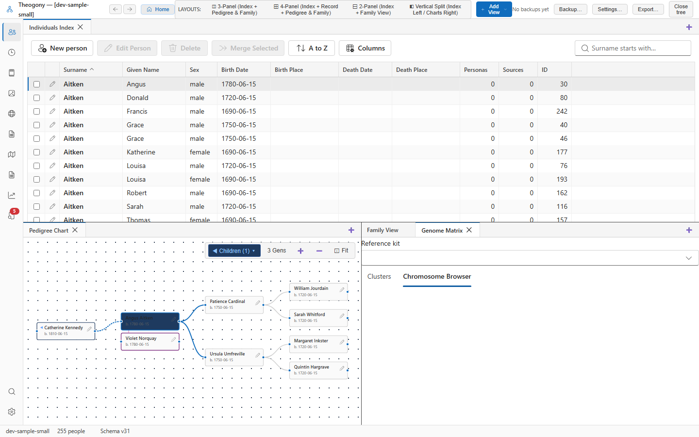

# DNA chromosome browser

The DNA Chromosome Browser visually maps and paints shared genetic segments across chromosomes 1 through 22 and the X chromosome. Open this screen when you want to triangulate shared DNA segments among multiple cousins, map maternal versus paternal crossovers, or link specific chromosomal regions to ancestral couples.

## What you see

- **Reference Kit Selector:** Select whose genome is being visualized.
- **Chromosome Canvas:** Displays tracks for all 22 autosomes and the X chromosome, scaled accurately according to physical base-pair lengths:
  - **Paternal Track (Top/Bottom Bar)**: Shows segments inherited through the father's ancestral lines (rendered in blue by default).
  - **Maternal Track**: Shows segments inherited through the mother's ancestral lines (rendered in red/pink by default).
  - **Unplaced Track**: Shows newly imported segments whose parental side has not yet been determined.
- **Segment Inspector and Tagging Panel:** When you click any segment on the canvas, this panel displays:
  - **Chromosome Number**: E.g., `Chr 7`.
  - **Start and End Positions**: Base-pair coordinates (e.g., `12,450,000 – 34,800,000`).
  - **Segment Size**: Length in centimorgans (cM) and SNP count.
  - **Matching Tester**: Name of the genetic match sharing this segment.
  - **Parental Side Toggle**: Assign to **Maternal**, **Paternal**, or **Unplaced**.
  - **Linked Ancestor (MRCA)**: Connect the segment directly to the specific ancestral couple who passed it down.
  - **Custom Label and Color**: Set descriptive tags (e.g., *"Hale Paternal Line"*).

## Common tasks

### Paint and assign a shared segment to an ancestral side

1. Click on an unplaced segment bar on any chromosome (for example, on Chromosome 3).
2. Review the match's identity in the **Segment Inspector**.
3. If this match is known to be a maternal 2nd cousin, select the **Maternal** radio button.
4. Select **Save Segment**.

The segment moves to the maternal track and updates its color instantly, building out your chromosome map.

### Link a triangulated segment to an ancestral couple

1. Click an overlapping segment shared by two independent cousins.
2. In the inspector, select **Link Ancestor**.
3. Search for and select the Most Recent Common Ancestor (MRCA) couple (e.g., *Samuel Hale & Hannah Ross*).
4. Enter a descriptive label (such as `Samuel Hale Chr 14 Block`).
5. Select **Save Segment**.

Any other match sharing that exact genomic block can now be linked directly to Samuel Hale.

### Analyze X-DNA matches

1. Scroll down to the **X Chromosome** track at the bottom of the canvas.
2. Inspect any matching segments.
3. Because the X chromosome follows unique non-recombining inheritance patterns (men inherit X solely from their mother; women inherit one X from their father and one from their mother), use the displayed segments to eliminate entire branches of your ancestral tree that could not mathematically pass down X-DNA.

## Practical use cases

- **Genetic triangulation to prove a brick-wall ancestor:** Identify three descendants of an 18th-century couple through different children who all share an identical 15 cM segment at the exact same location on Chromosome 9. Painting these segments proves that the segment was inherited from that common ancestral couple, providing conclusive genetic evidence for your proof summary.
- **Mapping chromosome crossovers:** By phasing segments into maternal and paternal tracks, you can see the exact recombination points where maternal and paternal chromosomes exchanged genetic material when passed to you.
- **Distinguishing between parent-child and sibling matches:** Visually inspect full versus half-identical regions to distinguish sibling relationships from parent-child relationships.

## Good to know

- Segment boundaries use the standard GRCh37 / hg19 human genome coordinate assembly, matching data from AncestryDNA, 23andMe, FTDNA, and GEDmatch.
- Hovering your mouse over any segment on the canvas displays a live tooltip showing match name, chromosome coordinates, and cM size.
- Painting segments is completely non-destructive; you can reassign a segment's parental side or update its linked ancestor at any time.
