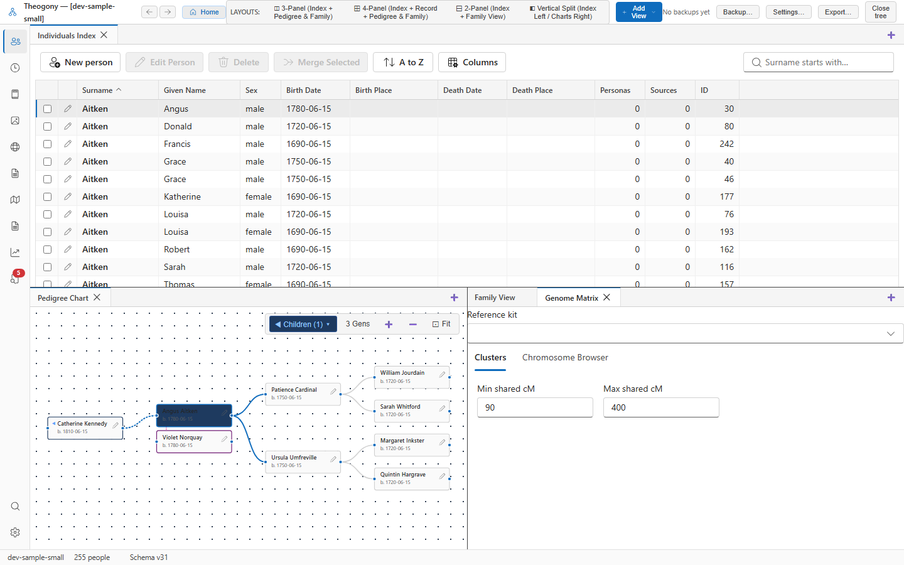

# DNA cluster matrix (Leeds method)

The DNA Cluster Matrix automates the **Leeds Method** (developed by Dana Leeds) to sort your autosomal DNA matches into distinct, color-coded clusters representing your four ancestral grandparent lines. Open this screen when you want to solve unknown parentage questions, identify which ancestral line a mystery match belongs to, or isolate your maternal and paternal branches.

## What you see

- **Cluster Configuration Toolbar:**
  - **Reference Kit Dropdown**: Select which tested individual's matches are being clustered.
  - **Min Shared cM**: Minimum centimorgan threshold (defaults to `90 cM` per standard Leeds Method guidelines).
  - **Max Shared cM**: Maximum centimorgan threshold (defaults to `400 cM`, filtering out immediate relatives like parents, aunts, and 1st cousins who bridge multiple grandparents).
- **The Cluster Matrix Canvas:** An interactive visual matrix plotting matches against each other:
  - Rows and columns represent individual matches sorted in descending order of shared cM.
  - Each cell marks a shared in-common-with (ICW) connection between two matches.
  - Distinct color swatches (from your active theme palette) identify the primary cluster assigned to each match.
- **Cluster Management Side Panel:** Lists each identified cluster, displaying:
  - Cluster seed match and total member count.
  - **Label Field**: Text input to name the cluster (e.g., *"Cluster 1: Paternal Grandfather - Hale/Ross"*).
  - **Save Label**: Button to commit the cluster title.
  - **Link Ancestor**: Search tool to connect the cluster directly to a specific person or couple in your tree.

## Common tasks

### Generate a Leeds Method cluster matrix

1. Select your target tester in the **Reference kit** dropdown.
2. Ensure the centimorgan boundaries are set to standard values (`90 cM` minimum and `400 cM` maximum).
3. Theogony automatically computes the pairwise in-common-with network and renders the matrix.
4. You should see distinct colored blocks along the diagonal, ideally forming four primary clusters representing your four grandparents.

### Label a cluster and link an ancestor

1. Identify a cluster that contains known cousins from a specific family line (for example, finding a known 2nd cousin on your mother's father's line).
2. In the side panel card for that cluster, enter a title in the label box (such as `Maternal Grandfather - Miller`).
3. Select **Save label**.
4. Select **Link ancestor** and choose the ancestral couple (`Jacob Miller & Sarah Davis`) from your tree.

The cluster is now labeled throughout Theogony, and any unplaced matches in that cluster can immediately be assigned to that specific ancestral line.

### Adjust thresholds for smaller or endogamous trees

1. If you have fewer matches or are researching an older generation:
   - Lower the **Min shared cM** to `60 cM` or `50 cM` to pull in more distant 3rd cousins.
2. If researching an endogamous population (such as colonial Acadian or Ashkenazi lineages) where matches share multiple segments:
   - Raise the **Min shared cM** to `120 cM` or `150 cM` to eliminate background population noise.

The matrix recalculates instantly as you change the numbers.

## Practical use cases

- **Unknown parentage and adoptee searches:** When the biological parents of an individual are completely unknown, generate a Leeds matrix. The resulting four clusters immediately group matches into the biological grandparents. Identifying a known surname or tree in even one cluster eliminates 50% or 75% of potential candidate families.
- **Sorting unidentified DNA matches:** When an unknown match sharing 150 cM appears in your match list with no family tree attached, open the matrix. If they fall squarely into Cluster 3 (your maternal grandmother's line), you know immediately which branch of your family to investigate without guessing.
- **Detecting double-cousin relationships:** A match that lights up with two distinct color swatches indicates that they share DNA through two independent family lines (such as siblings who married siblings).

## Good to know

- Matches sharing more than 400 cM (such as 1st cousins or aunts/uncles) share DNA from two grandparents and will naturally bridge clusters. The 400 cM ceiling filters them out so the four distinct grandparent quadrants appear clearly.
- Color swatches in the matrix use your active skin theme, repainting cleanly in both light and dark modes.
- Cluster labels and ancestor links are stored directly in your tree database and remain persistent across research sessions.
