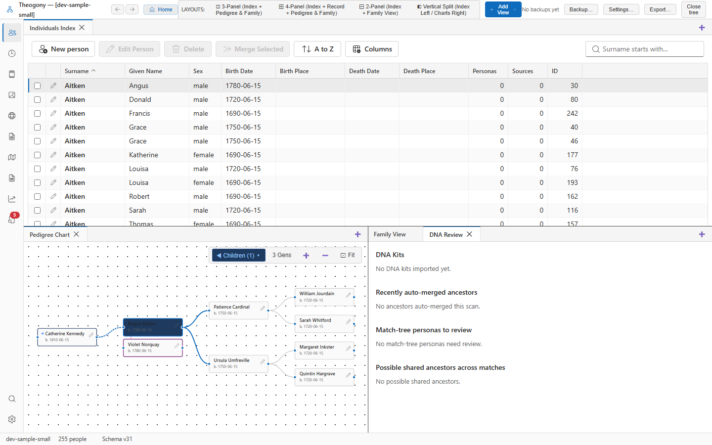

# Haplogroup lineage lookup

The Haplogroup Lineage Lookup panel traces direct paternal (Y-DNA) and direct maternal (mtDNA) haplogroups through the human phylogenetic tree. Open this screen when you want to explore the evolutionary hierarchy of your haplogroup, compare testing company predictions against full sequencing results, or trace lineage pathways from ancient roots down to modern terminal subclades.

## What you see

- **Lineage Input Toolbar:**
  - **Haplogroup Name Input**: Enter any valid Y-DNA or mtDNA branch notation (e.g., `R-M269`, `I-L22`, `H1a3`, or `U5b1b`).
  - **Tree Selector**: Toggle between **Y-DNA (Paternal)** and **mtDNA (Maternal)** phylogenetic trees.
  - **Kit Selector**: Quickly populate the input from any imported DNA kit in your database.
- **Phylogenetic Lineage Pathway:** An interactive stepped hierarchy displaying the branch sequence from the root ancestor down to the entered subclade:
  - **Branch Names**: Standard ISOGG and mutation-based nomenclatures.
  - **Defining SNP Mutations**: Specific genetic single-nucleotide polymorphisms that define each branching point.
  - **Estimated Age (BP / BCE)**: Calculated age of the mutation in thousands of years before present.
- **Actions Panel:** Direct button to **Open in Migration Map** to visualize the geographic route associated with the lineage.

## Common tasks

### Trace the path of a paternal Y-DNA haplogroup

1. Set the tree selector to **Y-DNA (Paternal)**.
2. Enter your terminal haplogroup (for example, `R-DF13` or `R-L21`) into the haplogroup input.
3. Select **Lookup Lineage**.
4. The panel displays the complete paternal lineage path:
   `Y-Adam` $\rightarrow$ `A` $\rightarrow$ `BT` $\rightarrow$ `CT` $\rightarrow$ `F` $\rightarrow$ `K` $\rightarrow$ `P` $\rightarrow$ `R` $\rightarrow$ `R1` $\rightarrow$ `R1b-M343` $\rightarrow$ `M269` $\rightarrow$ `L21` $\rightarrow$ `DF13`.
5. Each node lists its defining SNPs and estimated divergence age.

### Compare different company haplogroup predictions

1. If 23andMe or AncestryDNA reports an older, broad haplogroup such as `R-M269`, but a relative's Big Y test reports a specific subclade like `R-FT12345`:
2. Look up the specific subclade in this tool.
3. Verify that `R-M269` is an upstream ancestral node on the exact same direct path, proving that the two test results are fully compatible and simply differ in resolution.

### Open migration routes for a lineage

1. With a haplogroup displayed, select **Open in Migration Map**.
2. Theogony launches the **Ancient DNA Migration Map** centered on your lineage, illustrating the prehistoric route and ancient archaeological burials sharing that mutation.

## Practical use cases

- **Harmonizing test results across family members:** Confirm whether two cousins who tested at different times with different companies belong to the same direct paternal or maternal lineage.
- **Surname project analysis:** In Y-DNA surname studies, determine whether multiple branches carrying the same surname share a common medieval forefather or represent independent paternal origins by comparing where their subclades branch apart on the Y-tree.
- **Deep ancestry timeline construction:** Use the calibrated mutation dates to establish an approximate historical era when major lineage branches formed (e.g., Bronze Age expansion versus Iron Age migrations).

## Good to know

- Theogony contains embedded, comprehensive phylogenetic trees for both Y-DNA and mtDNA; lookups operate entirely offline with no internet access required.
- The tool accepts both shorthand SNP designations (e.g., `R-U106`) and traditional longhand alphanumeric nomenclatures (e.g., `R1b1a1b1a1a`).
- Looking up a haplogroup does not modify any kit records; it is a purely analytical reference tool.
