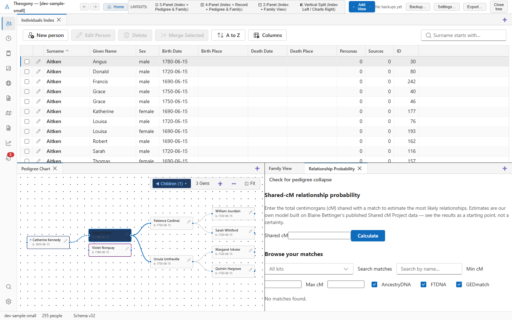

# Relationship probability calculator

Determine statistical likelihoods of relationship degrees for shared centimorgan amounts. Open this screen when you want to estimate possible relationships for DNA matches or compare Y-STR marker values.

## What you see

The shared-cM calculator section contains an input box for centimorgans and a **Calculate** button to generate probability tables.

The match browser provides a toolbar with a kit selector, a **Search matches** input, minimum and maximum centimorgan number fields, company checkboxes, and a region filter.

The table displays matches with columns for names, tested kits, shared centimorgans, predicted relationships, genetic sides, regions, check odds actions, and notes.

The Y-STR distance calculator section includes two kit dropdowns to compare marker values and view generation estimates.

The anchors section lists inferred matches linked to your tree by side.

## Common tasks

### Calculate relationship probabilities

1. Enter the total centimorgans in the **Shared cM** box.
2. Select **Calculate**.

The table of estimated relationships appears below the calculator section.

### Browse and filter matches

1. Choose a kit from the kit selector dropdown.
2. Type a name in the **Search matches** input.
3. Enter minimum and maximum centimorgan values in the respective boxes.

The table updates to show only matches matching your criteria.

### Check Y-STR distance

1. Choose the first kit from the **Kit A** dropdown.
2. Choose the second kit from the **Kit B** dropdown.

The estimated generations and confidence percentile appear below the dropdowns.

## Good to know

- Calculations are based on published Shared cM Project data models.
- Home kits typically lack self-reported Y-STR marker values because testing company exports report markers relative to matches.
