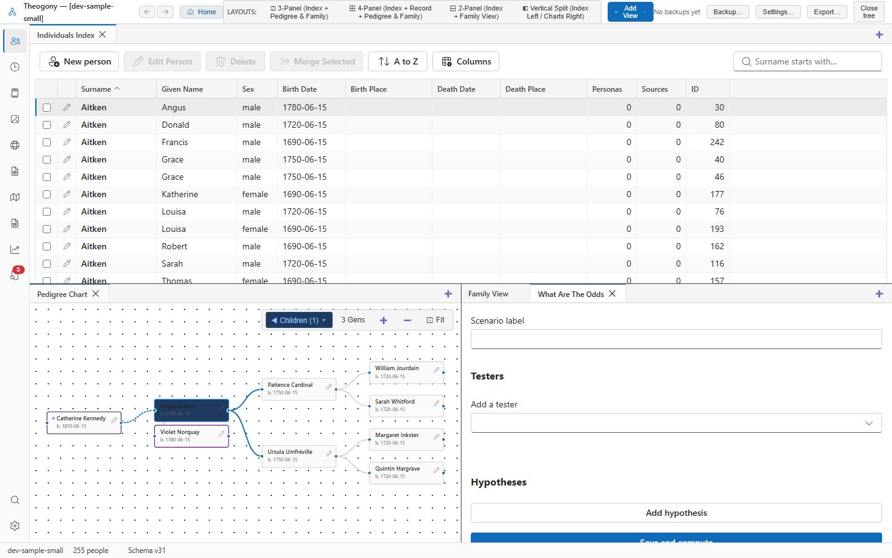

# What Are The Odds (WATO)

The What Are The Odds (WATO) tool (based on the methodology created by Leah Larkin) evaluates competing genealogical placement hypotheses for an unknown person or adoptee against multiple known DNA matches. Open this screen when you want to discover where an unknown ancestor or mystery match fits into an existing family tree.

## What you see

- **Scenario Header:** Displays the target mystery kit identifier, scenario title, and scenario management controls.
- **Known Testers Panel:** A list of verified family members in your tree who have taken a DNA test:
  - **Tester Name and Tree Link**: Connects to the person in your family pedigree.
  - **Shared cM with Mystery Kit**: The exact centimorgan amount the mystery person shares with each known tester.
  - **Add Tester Button**: Adds additional tested relatives to the calculation.
- **Hypotheses Configuration Table:** Displays candidate placements for the mystery individual:
  - **Hypothesis Label**: Descriptive name (e.g., *"Hypothesis 1: Child of Samuel Hale"* or *"Hypothesis 2: Child of Joseph Hale"*).
  - **Tree Placement Node**: Identifies where the mystery individual would attach in the pedigree.
  - **Calculated Score**: Mathematical likelihood score computed from the combined probability distributions of all testers.
  - **Odds vs. Second Best**: The odds ratio comparing the top hypothesis against the next most likely alternative.
- **Support Readout Banner:** Automatically interprets the odds ratio using Leah Larkin's established scientific thresholds:
  - **Well supported** (Odds $\ge$ 10.0 $\times$ second best).
  - **Some support, consider testing another relative** (Odds between 1.0 and 10.0 $\times$).
  - **Inconclusive** or **Eliminated** (Score of 0, proving the hypothesis is genetically impossible).

## Common tasks

### Set up a WATO scenario for an unknown ancestor

1. Enter a descriptive title in the **Scenario label** field (for example, *"Father of William Hale (b. 1872)"*).
2. Select **Add Tester**.
3. Choose a known cousin from your tree who matches the mystery person, and enter the total shared cM (e.g., Cousin A shares `180 cM`).
4. Repeat for all other known cousins who match the mystery person (e.g., Cousin B shares `340 cM`, Cousin C shares `95 cM`).
5. Select **Save & Calculate**.

### Add and compare placement hypotheses

1. Select **Add Hypothesis**.
2. Enter a label (e.g., `Hypothesis 1: Child of George Hale`).
3. Set the proposed parental couple in your tree.
4. Add a second hypothesis for a competing candidate (e.g., `Hypothesis 2: Child of Thomas Hale`).
5. Select **Save & Calculate**.

Theogony evaluates the mathematical distributions across all testers simultaneously and displays the comparative scores.

### Interpret the odds ratio

1. Look at the **Odds vs. Second Best** column and the **Support Readout Banner**:
   - If Hypothesis 1 yields a score of `15,000` and Hypothesis 2 yields `750`, the odds ratio is **20:1** in favor of Hypothesis 1, marked as **Well supported**.
   - If any hypothesis receives a score of `0`, it is mathematically impossible given the reported cM values and can be definitively eliminated from your research.

## Practical use cases

- **Adoptee parentage identification:** When an adoptee matches several 2nd and 3rd cousins from the same ancestral family, place the cousins in their verified tree positions, enter their shared cMs with the adoptee, and test hypotheses for which of three brothers was the biological father.
- **Solving unknown grandfathers:** When an illegitimate birth in the late 19th century leaves a father's identity unrecorded in civil registers, use WATO with modern descendants' DNA to identify which local candidate was the biological parent.
- **Directing targeted testing:** If two hypotheses are closely matched (e.g., odds of only 2:1), WATO helps you identify which specific branch of the family would resolve the ambiguity if an additional cousin were tested.

## Good to know

- WATO scores are recomputed live from the database and probability tables; they update immediately whenever you adjust tester cM values or hypothesis placements.
- A score of 0 indicates that at least one tester's shared cM falls outside the genetically possible range for that proposed relationship tier.
- Multiple scenarios can be saved and named per kit, allowing you to test independent theories without losing previous work.
