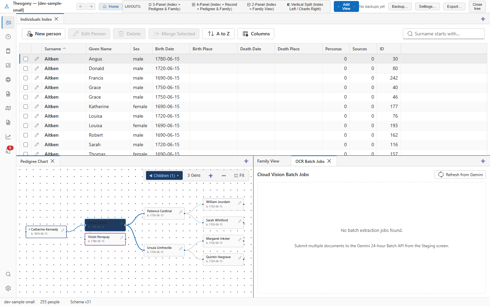

# Extraction estimate dialog

The Extraction Estimate Dialog calculates anticipated LLM token usage, estimated costs, and execution times before running complex genealogical extraction passes. Open this screen to review expected costs and item counts for document processing through Google Gemini before committing to an extraction run.

## What you see

The upper notice area displays the target repository name, the count of documents queued for processing, and an indication of whether original images accompany the text. 

The metric grid presents the operational details across five distinct cards. The model name appears first, followed by the total call count combining extraction and classification passes. Next, the input token count and output token allowance show the expected data volume. The estimated max cost appears last, displaying the calculated monetary total or the free tier status.

The action buttons sit at the bottom edge of the dialog window. Select **Cancel** to dismiss the window without running the process, or select **Extract** to proceed with the planned extraction job.

## Common tasks

### Run or cancel an extraction pass

1. Review the token counts, model name, and estimated max cost in the metric grid.
2. Select **Extract** to confirm and begin processing, or select **Cancel** to close the dialog without running the job.
