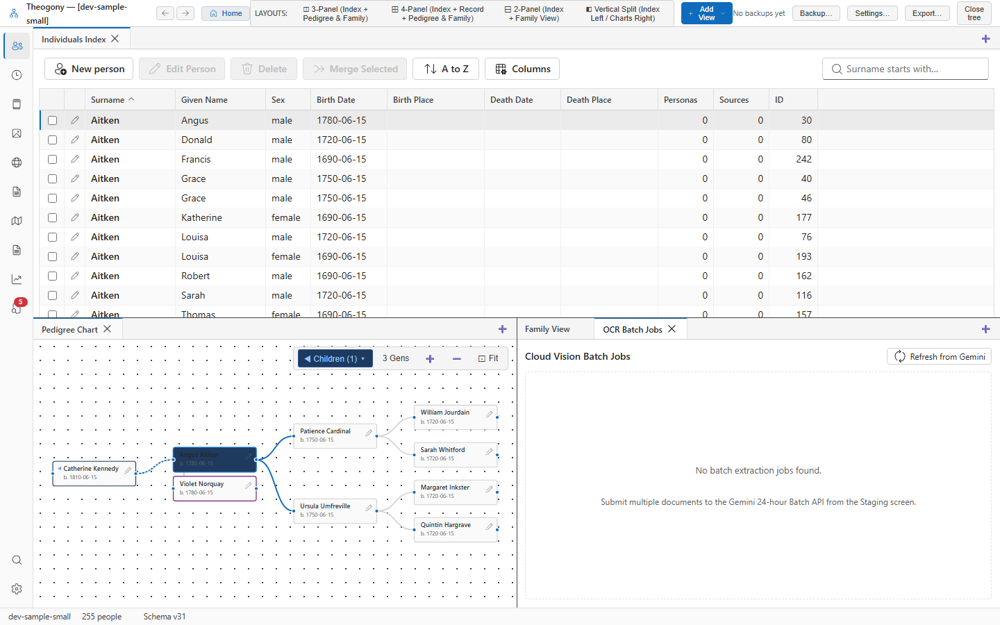

# OCR cost and time estimate

Review token counts, costs, and processing times before running cloud vision models on large document sets. Open this dialog from the document staging area when you are ready to process single scans or submit batch extraction jobs.

## What you see

The dialog displays a header showing either **Cloud Vision Extraction (Gemini AI)** for single documents or **Cloud Vision Extraction (Gemini Batch)** for multiple documents. A notice below the title states the repository name and the number of document images you are sending for transcription.

The metric grid shows technical estimates for the run. These include the model name, input token count, output token allowance, and the estimated cost formatted in US dollars. For batch jobs, the grid shows the number of eligible documents and reflects a fifty percent discount.

A refusal box appears if any documents are excluded from processing. This section lists each excluded document number alongside the specific reason for refusal.

The bottom action bar contains buttons to cancel the operation or proceed with extraction. The confirmation button is labeled **Run Extraction** for single scans and **Submit Batch Job** for multiple scans.

## Common tasks

### Run a single document extraction

1. Select **Run Extraction** to send the document image to Google Gemini for transcription and close the dialog.

### Submit a batch extraction job

1. Review the list of excluded documents in the refusal box if the batch contains ineligible items.
2. Select **Submit Batch Job** to send all eligible documents to the twenty-four-hour batch API and close the dialog.

## Good to know

The confirmation button remains disabled if an error occurs, if documents are refused, or while the software calculates token counts and costs.
