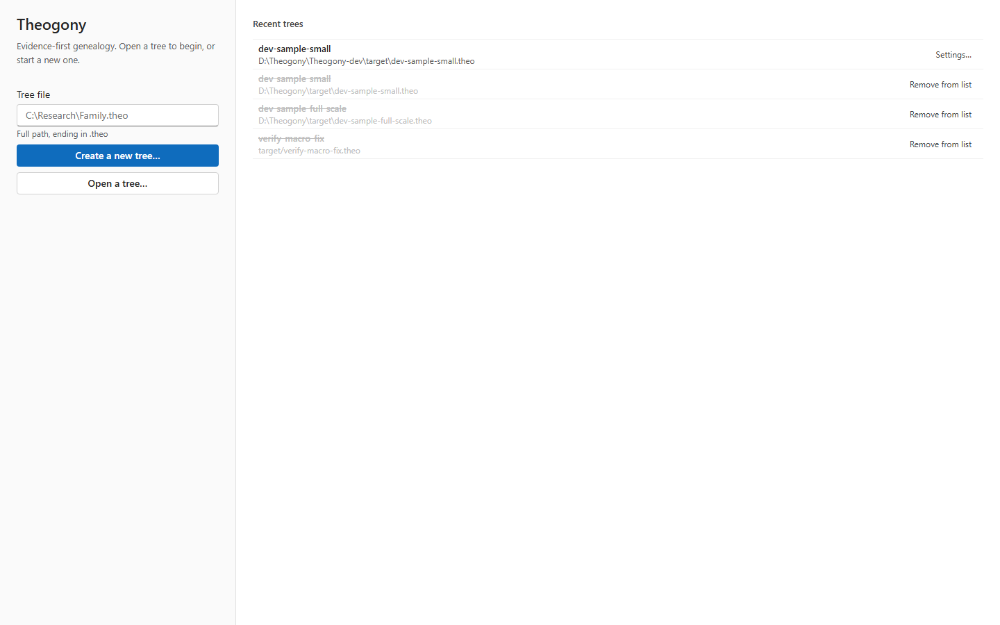

# Welcome and tree manager

Use the Welcome screen to create a new genealogical database, open an existing tree file, or manage your recent research. You see this screen when you launch the application before opening any database.

## What you see

The left column contains the primary actions for starting work. Use **Tree file** to type a file path, **Create a new tree...** to start a fresh database, and **Open a tree...** to select an existing file from your storage.

The right side displays the **Recent trees** list. Each entry shows the database name and its full file path. Existing files include a **Settings...** button, while missing files show a **Remove from list** button.

## Common tasks

### Create a new tree

1. Select **Create a new tree...**.
2. Choose a save location and filename in the dialog box.

The application creates the new database and opens the main workspace.

### Open an existing tree

1. Select **Open a tree...**.
2. Locate and select your database file in the dialog box.

The application loads the selected tree and opens the main workspace.

### Open a recent tree

1. Locate your database in the **Recent trees** list.
2. Select the database name.

The application loads the selected tree.

### Remove a missing tree from the list

1. Locate the greyed-out database entry in the **Recent trees** list.
2. Select **Remove from list**.

The application clears the dead entry from the display.

## Good to know

- Tree files use the extension .theo.
- Entries in the recent list update automatically as you open databases.
