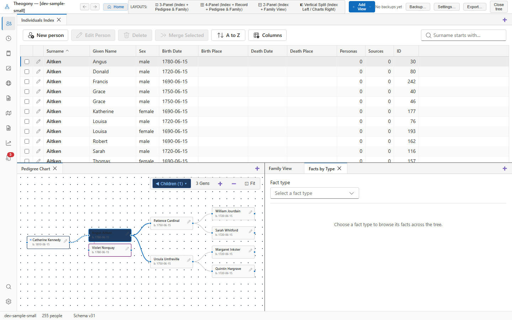

# Browse facts by type

Groups all recorded events and assertions across your tree by category to help you analyze data across different individuals and families. Open this view when you want to examine every instance of a specific fact type, such as a census or military service, in one place.

## What you see

The upper toolbar contains the primary controls for choosing categories. Use the **Fact type** dropdown to select the event category you want to view. When a fact type is selected, the **Select all matching** checkbox and the **Move to** dropdown become available for bulk operations.

The main table displays individual records matching your chosen category. The columns show the **Owner**, **Date**, **Value / description**, and **Sources** for each entry, with a selection checkbox at the start of each row.

The pagination controls at the bottom of the table show your current position and allow you to move between pages when the results exceed fifty rows.

## Common tasks

### Browse facts by category

1. Select **Fact type**.
2. Choose a category from the dropdown list.
3. Review the matching entries in the table.

### Select and move facts

1. Select **Fact type**.
2. Choose a category from the dropdown list.
3. Select the checkboxes for the specific rows you want to change, or select **Select all matching**.
4. Select **Move to** and choose the target fact type.
5. Select **Move selected**.

## Good to know

- Select a tree to open before you attempt to view fact categories.
- The table loads records in pages of fifty items. Use the pagination buttons at the bottom of the list to view additional pages.
