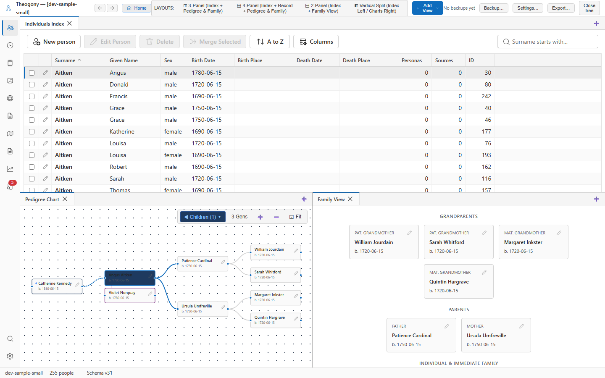

# Browse people

The Browse People screen is the master directory of every individual recorded in your family tree. Open this screen whenever you need to locate an ancestor, filter by surname or location, inspect vital date ranges, or perform bulk record management.

## What you see

- **Search Bar:** Located at the top of the pane. Enter any part of a given name or surname to filter the entire directory in real time.
- **Action Toolbar:** Houses the **Add person** button to create a new individual, and the **Delete** button to safely remove selected individuals.
- **The Individuals Grid:** A high-performance virtualized table displaying:
  - **Given Names and Surname:** Rendered with the primary sort name.
  - **Sex:** Displayed with clear indicators (`M`, `F`, `X`, `U`).
  - **Birth and Death Details:** Dates and standardized places for each individual.
  - **Selection Checkboxes:** Allow selecting individual or multiple records.
- **Status Footer:** Shows the total number of individuals in the database and the number of currently selected rows.

## Common tasks

### Search for an ancestor

1. Click into the search field at the top of the screen (or press your tab key until focused).
2. Type any portion of a first or last name (for example, `Eleanor` or `Hale`).
3. The list filters instantly. Press `Down Arrow` to navigate straight into the results.

### Open a person's full record

1. Locate the person in the grid using the search bar or arrow keys.
2. Double-click the row, or press **Enter**.

The full **Person** editing panel opens in your workbench, and all related charts and family views automatically synchronize to that individual.

### Add a new person

1. Select **Add person** in the toolbar.
2. In the dialog, enter the prefix, given names, surname, and suffix into their dedicated boxes.
3. Select the sex (`Male`, `Female`, `Other/Intersex`, or `Unknown`).
4. Select **Add person** to commit the record.

The dialog closes and the new individual appears immediately in the grid. Nothing is written if you select **Cancel**.

### Copy person data into a spreadsheet

1. Select one or more rows (use **Ctrl + Click** for specific people or **Shift + Click** for a continuous range).
2. Press **Ctrl + C**.
3. Open Excel, Google Sheets, or LibreOffice Calc and press **Ctrl + V**.

The selected people paste cleanly as tab-separated columns complete with headers.

### Delete individuals safely

1. Select the checkbox next to the person or people you wish to remove.
2. Select **Delete** in the toolbar.
3. Review the **Delete Preview Dialog**, which details how many facts and families are affected, and confirms that underlying document evidence personas are preserved.
4. Select **Delete** to confirm.

The deletion is recorded as a single action in **Edit History**, allowing you to revert it at any time.

## Practical use cases

- **Surveying surname spelling variations:** Search by root strings (e.g., `Dav` to review *Davis*, *Davies*, *Davison*) to see all family branches clustered together.
- **Finding individuals missing vital facts:** Sort by the Birth or Death date columns to group individuals who lack verified dates, helping you prioritize census or parish register searches.
- **Spreadsheet analysis for FAN principle research:** When researching the Friends, Associates, and Neighbors (the FAN club) of an ancestor in a specific township, select all residents of that town, copy them to your clipboard (**Ctrl + C**), and paste them into a research spreadsheet to cross-reference with tax lists.

## Good to know

- Columns can be resized by dragging the header dividers. Theogony remembers your column widths and sort preferences.
- The first column stays frozen in place so the individual's name remains visible when you scroll horizontally.
- Even if your tree contains over 100,000 individuals, the grid remains fast and smooth because it renders only the rows visible on screen.
