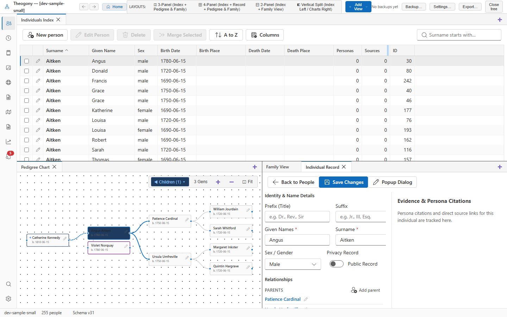

# Edit a person

The Person editor is the central workspace for compiling an individual's biographical timeline, managing their parentage and marital relationships, recording life events, and attaching documentary proof.

## What you see

- **Biographical Header:** 
  - Displays the primary name in the record serif font.
  - Life date span and calculated age at death (or current age for living relatives).
  - Status badges for sex (`M`, `F`, `X`, `U`), living status, and privacy flag.
  - Action buttons: **Add Event**, **Add Source**, and **Edit Details**.
- **Names Section:** Lists the primary legal or birth name alongside any alternate names, maiden names, aliases, or anglicized spellings.
- **Relationships Panel:**
  - **Family as Child:** Displays the individual's parents and full or half-siblings.
  - **Families as Partner:** Displays each spouse or domestic partner, marriage dates, and the children born to each union.
- **Events and Facts Grid:** Chronological timeline of all recorded life events (Birth, Baptism, Census, Residence, Military Service, Will, Death, Burial, Probate), complete with dates and place jurisdictions.
- **Evidence and Citation Panel:** Displays the underlying citations, informant evaluations, and proof summaries for the currently focused fact.
- **Notes and Media:** Space for biographical research notes and a gallery strip of linked portrait photos and document scans.

## Common tasks

### Record a new life event or fact

1. Select **Add Event** in the header toolbar.
2. In the dialog, select the event type (e.g., *Birth*, *Census*, *Occupation*, *Death*).
3. Enter the date (e.g., `14 Oct 1882` or `abt 1850`).
4. Enter the place jurisdiction in the place field.
5. Select **Save**.

The event appears in chronological order in the events grid.

### Add a spouse or partner

1. In the Relationships section, select **Add Spouse / Partner** (or right-click and choose **Add relative**).
2. If the person has existing families with an open partner slot, Theogony asks which family to use or whether to create a new family. Choose the appropriate option.
3. Enter the partner's name parts and sex, or search for an existing person already in your tree.
4. Select **Save**.

The new partnership is created and connected.

### Add a child with multiple marriages

1. In the Relationships section, select **Add Child**.
2. If the individual has more than one spouse, Theogony opens the **Choose Family** dialog listing each marriage (e.g., *"With Sarah Jenkins"* or *"With Mary Hale"*).
3. Select the correct family for the child.
4. Enter the child's details and select **Add person**.

The child is linked directly to the selected parents, leaving the other marriage untouched.

### Attach a citation to a fact

1. Select an event row in the Events and Facts grid (for example, the *Birth* event).
2. In the Evidence side panel, select **Add Citation**.
3. Select an existing master source from your catalog or create a new source.
4. Enter the page number or certificate reference, and paste the transcription text.
5. Select **Save**.

The citation is linked directly to that specific fact and appears in all export reports.

## Practical use cases

- **Building a comprehensive biographical chronology:** Add census entries across successive decades (1850, 1860, 1870, 1880) to trace an ancestor's migration trail from Virginia through Ohio to Illinois.
- **Resolving blended families and half-siblings:** Clearly document a widow who remarried and had children across both unions. Each family maintains its own children and marriage facts, avoiding conflation.
- **Documenting conflicting birth evidence:** When a tombstone says 1845 but a baptism register proves 1843, record both claims in the timeline and use the evidence notes to explain why the contemporary church record overrides the later cemetery marker.

## Good to know

- You do not need to click a global "save" button for the entire record. Each event, relationship, or name edit is saved immediately upon closing its respective dialog.
- If you make edits in an open form and try to navigate away or close the tab, Theogony's unsaved-changes guard protects your work and prompts you to save or cancel.
- Selecting any person in the Relationships section switches the entire workbench context to that individual.
