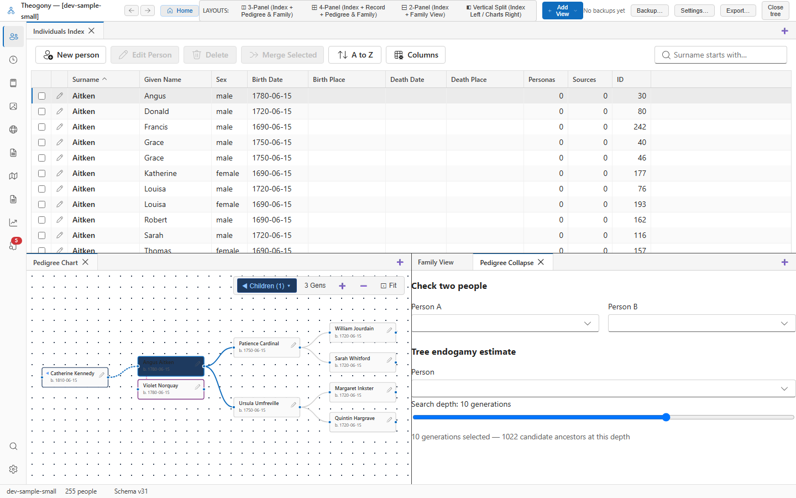

# Pedigree collapse and endogamy

Identify duplicate ancestors across ancestral lines and calculate genetic inheritance impacts. Open this panel when studying genetic overlap between two individuals or estimating inbreeding within an ancestor cone.

## What you see

The panel contains two main sections for analyzing ancestral relationships. The upper section provides fields for **Person A** and **Person B** to check pedigree collapse between a pair of individuals. The lower section provides a person selector and a search depth slider to estimate tree endogamy for a single individual. Both sections display calculation results in tables and text summaries when valid individuals are chosen.

## Common tasks

### Check pedigree collapse between two people

1. Select **Person A** and choose the first individual from the list.
2. Select **Person B** and choose the second individual from the list.
3. Review the common ancestor table and total expected centimorgans shown below the pickers.

### Estimate tree inbreeding

1. Select **Person** in the lower section and choose the subject individual from the list.
2. Drag the search depth slider to select between six and twelve generations.
3. Review the ancestor event table and generation count summary appearing below the slider.

## Good to know

- Calculations update automatically whenever you change selected individuals or adjust the search depth slider.
- Results require documented common ancestors within the selected generation depth.
