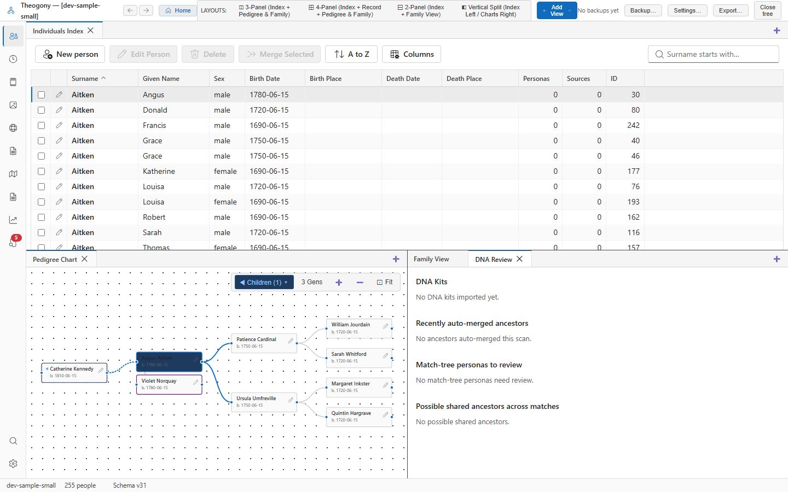

# Ancient DNA migration map

View prehistoric human migration pathways, haplogroup phylogeography, and ancient DNA sampling sites connected to maternal and paternal lineages. Open this screen when examining a kit with a recorded haplogroup.

## What you see

The application window displays the main toolbar across the top with tree navigation and layout options. The left sidebar contains tool icons for switching between views, including people, places, maps, and sources. The central work area shows open tabs such as the individuals index, pedigree chart, and DNA review. The status bar at the bottom indicates the current tree file name, total person count, and schema version.

## Common tasks

### Inspect a sample location

1. Select the map icon in the left sidebar to open the map view.
2. Select a circular marker on the map canvas to open its popup.
3. Review the sample haplogroup, ancestor distance, geographic location, age, and culture details.

### Navigate the map view

1. Select the map icon in the left sidebar to open the map view.
2. Drag the map canvas to pan across geographic regions.
