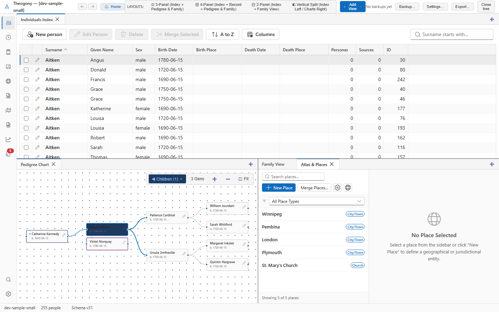

# Browse places

Manage geographic jurisdictions, place names, coordinates, and event linkages for your family tree. Open this screen when you need to standardise location names or organise the hierarchical containment of your genealogical events.

## What you see

The left sidebar holds the search box, action buttons, filter dropdown, and master list of locations. Use the search input to find locations by name or the dropdown to narrow the list by category.

The main pane on the right displays the selected location's details, historical name variants, and parent jurisdictions when an item is active.

## Common tasks

### Add a new place

1. Select **New Place**.
2. Type the location name in the **Place Name** field.
3. Choose a category from the **Place Type** dropdown.
4. Enter coordinates in the **Latitude** and **Longitude** fields if known.
5. Select **Create Place**.

### Edit place details

1. Select a location from the list in the sidebar.
2. Type changes into the **Place Name** field or modify the coordinates.
3. Select **Save Details**.

### Add a historical name variant

1. Select a location from the sidebar list.
2. Type the historical name in the **Historical Name** field under the historical names section.
3. Enter the active date range in the **From Date** and **To Date** fields.
4. Select **Add Name Variant**.

## Good to know

Changes made to place details save when you select **Save Details**, while historical names save immediately upon clicking their respective add buttons.
