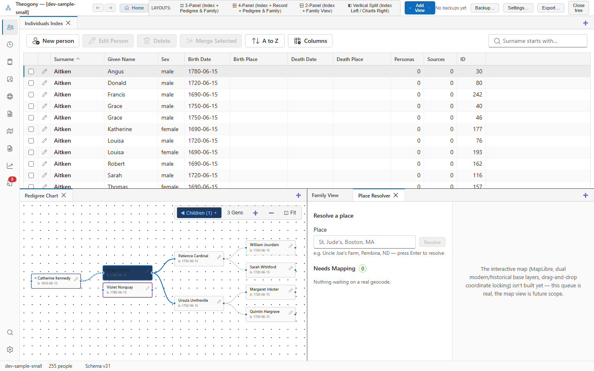

# Place resolver and atlas

Geocode locations, verify coordinates, and handle ambiguous historical place names or unmapped location strings in your tree. Open this screen when you need to assign coordinates to places or check which locations still require mapping.

## What you see

The sidebar on the left contains the **Resolve a place** section with a text input box labelled **Place** and a **Needs Mapping** queue showing a badge count of unmapped locations.

The right pane displays a placeholder note explaining that the interactive map view is planned for a future update.

## Common tasks

### Resolve a place name

1. Type a location into the text box under **Place**.
2. Press Enter to process the string.
3. View the confirmation message appearing below the input showing the resolved place and its source.

### Check unmapped locations

1. Locate the **Needs Mapping** heading in the sidebar.
2. Read the badge count to see how many locations lack real geocodes.
3. Review the items listed underneath to identify which place names are waiting on coordinates.

## Good to know

The queue automatically refreshes when you resolve a place.
