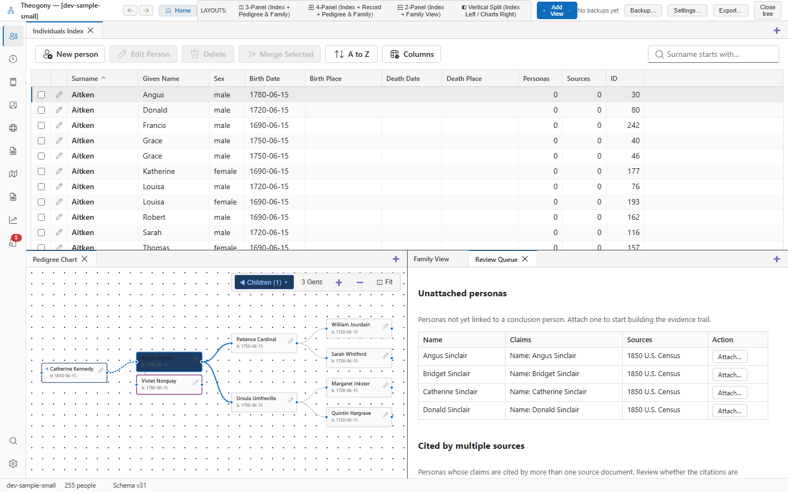

# Proposal review cards

The Proposal Review Cards interface provides a focused, step-by-step card deck for adjudicating AI-extracted claims. Open this screen from the Review Queue or Extraction Proposals when you want to evaluate candidate facts, match personas to existing ancestors, and accept verified evidence into your tree conclusions.

## What you see

- **Review Progress Bar:** Shows the active card number and the total number of candidate personas remaining in the deck.
- **The Evidence Card:**
  - **Document Citation Header:** Displays the title of the source record and a clickable snippet of the transcribed document text supporting the claims.
  - **Extracted Persona Profile:** Displays the candidate name as written in the record, recorded age, sex, and stated family relationships (such as *"Son of John Hale and Mary Hale"*).
  - **Person Matcher Section:** 
    - Suggests matching individuals already in your tree based on name and date similarity.
    - Includes a search tool to find any other person in your tree.
    - Includes a **Create as New Person** button to initialize a fresh individual with one click.
  - **Proposed Facts Checklist:** Each candidate assertion (Birth, Residence, Census, Marriage, Occupation) is presented as a distinct row with its proposed date and place, alongside action buttons: **Accept**, **Edit**, and **Reject**.
- **Card Navigation Toolbar:** **Previous Card**, **Skip for Later**, and **Next Card** buttons.

## Common tasks

### Match an evidence persona to an existing ancestor

1. In the **Person Matcher** section of the active card, review the suggested matches.
2. If your target ancestor is listed, select **Match This Person**.
3. If not listed in the suggestions, click **Search Tree**, type their name, and select them.

The persona is linked to that ancestor, and all proposed facts are ready to be integrated into their timeline.

### Accept and merge proposed facts into an individual's record

1. Review the proposed facts listed on the card.
2. For each verified event, select **Accept**.
3. If an extracted date needs refinement (such as changing an inferred `1862` to an exact date `14 May 1862` known from other sources), select **Edit**, make your adjustments, and select **Accept**.

The accepted events are written directly to the ancestor's timeline, complete with direct citation links back to the source document.

### Create a newly discovered relative

1. When a census or probate document reveals a previously unknown child or sibling:
2. In the Person Matcher section, select **Create as New Person**.
3. Theogony initializes a new individual using the persona's name, sex, and birth year.
4. Accept the proposed parent or sibling relationships.
5. Select **Next Card**.

The new individual is added to your tree, connected to their parents, and sourced in a single seamless flow.

### Reject an erroneous or irrelevant claim

1. If the extraction model captured a stray mention (such as a neighbor or an erroneous indexer note):
2. Select **Reject** on that specific claim row.

The assertion is marked as rejected in the evidence audit log and is not added to any person's timeline.

## Practical use cases

- **Working through an entire household from a census schedule:** Step through the family card by card: match the father, match the mother, link existing children, and create newly born toddlers as new individuals, citing the entire family in minutes.
- **Adjudicating complex probate heirs:** Step through a will that names married daughters whose married surnames were previously unknown. Use the card interface to add their married names and accept the parental link with complete documentary proof.

## Good to know

- Accepting a fact creates a permanent conclusion in your database linked to the underlying source persona.
- If you close the Review Cards interface halfway through a batch, Theogony remembers which cards were already processed. You can resume right where you left off.
- The entire review process is logged in **Edit History**, allowing you to revert accidental accepts or links with a single click.
