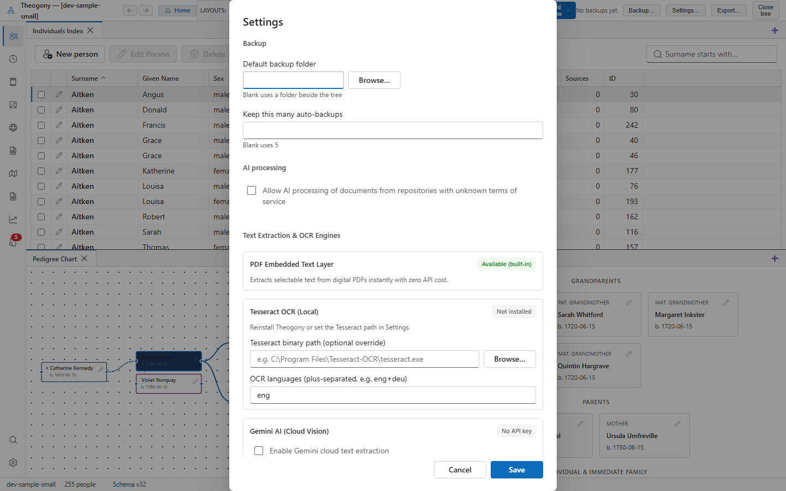

# Date format settings

Configure how the program reads ambiguous numeric dates across all data entry forms in your tree. Open this panel when you want to change whether numeric dates like 3/4/1850 are interpreted as day-first or month-first.

## What you see

The panel contains a single setting for date interpretation. The **Date format for numbers like 3/4/1850** section provides two options in a radio button group. The first option is **Day first (3/4/1850 is 3 April 1850)** and the second option is **Month first (3/4/1850 is 4 March 1850)**.

## Common tasks

### Change the numeric date format

1. Select **Day first (3/4/1850 is 3 April 1850)** or **Month first (3/4/1850 is 4 March 1850)** to set your preferred interpretation for ambiguous dates.

The program applies your selection immediately to all date entry fields across your tree.

## Good to know

- Changes to date formats save automatically as soon as you select a new option.
