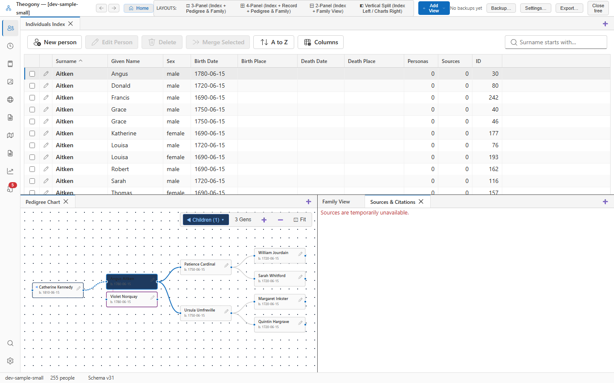

# Browse sources and citations

Manage and inspect documentary evidence, master sources, repositories, and citations linked to your genealogical data. You view this catalog when you need to review the quality and origin of the records supporting your research.

## What you see

The top navigation bar provides global controls for layouts, backups, settings, and exports. 

The sidebar on the far left contains icons to switch between primary views such as individuals, families, and media. 

The main data table displays individuals with columns covering names, sex, dates, places, and record counts. 

The lower right pane houses the **Sources & Citations** tab, which displays an alert message when evidence records are temporarily offline.

## Common tasks

### View source availability

1. Select the **Sources & Citations** tab in the lower right pane.
2. Read the status message displayed inside the panel.

You should see the notice indicating that sources are temporarily unavailable.
