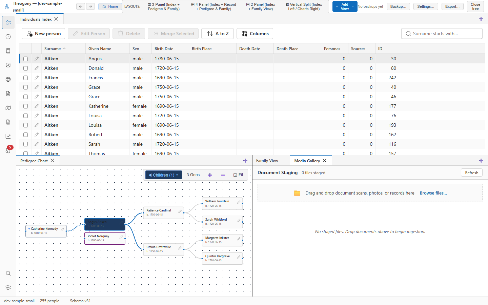

# Document and media inspection

Inspect historical documents, zoom and pan images, overlay transcriptions, and extract evidence personas. Open this screen when you want to examine source media in detail and connect document evidence to your tree.

## What you see

The document list on the left displays promoted media items along with their filenames, source document titles, and linked person counts. 

The main viewer area in the center displays the selected document for zooming, panning, and visual inspection.

The transcription overlay and extraction panels on the right provide tools to transcribe text and extract evidence personas from the active document.

## Common tasks

### Inspect a document

1. Select a file in the document list.
2. View the document image in the main viewer area.

### Apply a suggested type

1. Select a file in the document list.
2. Select **Apply suggested type**.

## Good to know

- Promote files from the Media Gallery before you can inspect them here.
- Each extraction run generates review cards for you to evaluate evidence personas.
