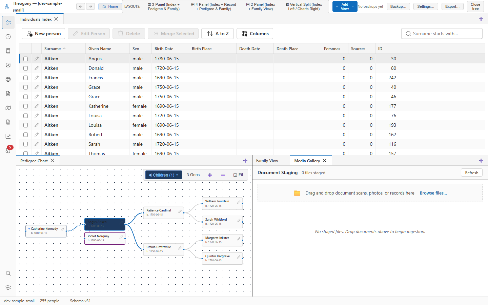

# Media staging and gallery

The Media Staging and Gallery screen is the intake hub for importing, cataloging, and organizing digital media in Theogony. Open this screen when you have downloaded document scans, photographed certificates at an archive, or gathered family photographs, and want to process them into your tree.

## What you see

- **Staging Intake Toolbar:** 
  - **Import Media...**: Opens a file dialog to choose image or PDF files from your disk.
  - **Filter by Status**: Filter the gallery by processing stage (e.g., *All*, *Unprocessed*, *OCR Complete*, *Linked to Person*).
  - **Search Input**: Find media items by file name, document type, or descriptive label.
- **Media Thumbnail Gallery:** A visual grid displaying high-fidelity thumbnails of all staged and imported documents:
  - Each card shows the image preview, file format (JPEG, PNG, TIFF, PDF), original file name, and ingestion date.
  - Processing badges indicate whether OCR text has been generated or AI extraction has been run.
- **Selected Media Actions Pane:** Provides one-click access to **Open in Viewer** (Promoted Media), **Run OCR**, **Run Extraction**, and **Link to Record**.

## Common tasks

### Import new documents and scans

1. Select **Import Media...** in the staging toolbar, or drag and drop image/PDF files directly from your computer desktop or file manager into the gallery window.
2. Theogony copies the files into the tree's content-addressed media store (`<tree>.media/`), calculates cryptographic hashes, and generates thumbnails.
3. The new items appear immediately at the top of the gallery ready for processing.

### Promote a document for deep reading

1. Select any document card in the gallery.
2. Select **Open in Viewer** (or double-click the thumbnail).
3. The document opens in the full **Promoted Media** viewer where you can zoom into handwriting, view OCR text overlays, and extract facts.

### Filter for unprocessed files

1. In the **Filter by Status** dropdown, select **Unprocessed**.
2. The gallery narrows to display only newly imported scans that have not yet had OCR run or been linked to family records.
3. Select an item to proceed with OCR transcription or citation linkage.

## Practical use cases

- **Processing archive research batches:** After a day at a county courthouse with your camera or portable scanner, drop all 50 deed and probate photos into Media Staging. Work through them systematically, running OCR, extracting the heirs, and linking each file to its corresponding master source.
- **Deduplicating shared family photos:** If multiple relatives send you copies of the same vintage wedding portrait under different file names, Theogony's content-addressed storage recognizes that the image data is identical and stores only one copy on disk, saving storage and preventing clutter.
- **Building a document pipeline:** Use Staging as a clear inbox. Documents sit in Staging until you have verified their transcriptions and linked them to conclusion individuals, ensuring no piece of acquired evidence gets lost or forgotten.

## Good to know

- Supported file types include JPEG, PNG, TIFF, WebP, and multi-page PDF documents.
- Files in the gallery are stored in `<tree>.media/` organized by two-character subdirectories based on their SHA-256 hash. If you move your `.theo` file, move this folder with it.
- Deleting an unlinked media item from Staging removes it from the database and discards the stored file, freeing disk space.
