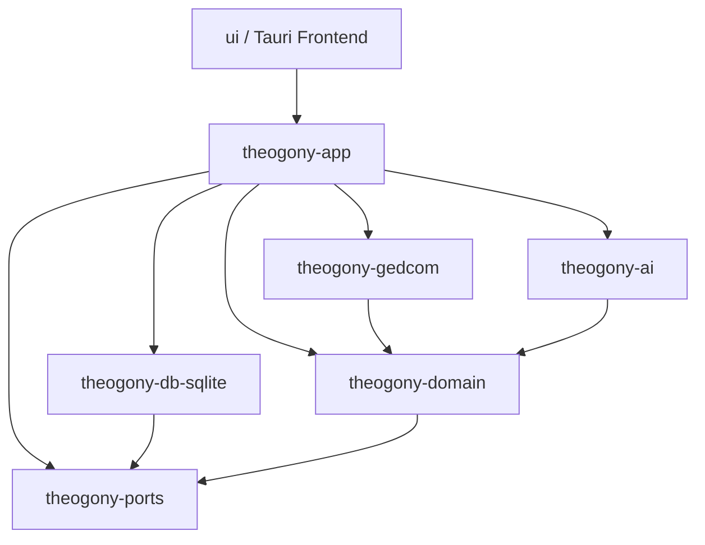

# Architecture Overview

Theogony is structured as a modular Rust workspace backend paired with a native-feeling desktop frontend built on Tauri, React, Vite, and Fluent UI v9. This document outlines the crate boundaries, data flow, persistence layers, interchange mechanisms, and UI organization.

## Workspace Structure and Crate Boundaries

The backend codebase is organized into distinct crates in the Cargo workspace, enforcing clear separation of concerns between domain logic, abstract ports, storage implementations, GEDCOM interchange, AI assistants, and application orchestration.

### 1. `theogony-domain`
- **Purpose**: Core genealogy domain model, rules, entities, and business logic.
- **Key Concepts**: Individuals, families, facts, citations, sources, places, jurisdictions, notes, and lineage trees.
- **Responsibilities**: Validating domain invariants, computing pedigree relationships, supporting event history logging, and defining domain types exported to TypeScript via `ts-rs`.

### 2. `theogony-ports`
- **Purpose**: Abstract interfaces (traits) defining repository contracts and service boundaries.
- **Responsibilities**: Decoupling domain logic and application commands from specific storage engines or external adapters, allowing interchangeable persistence and integration layers.

### 3. `theogony-db-sqlite`
- **Purpose**: SQLite persistence implementation satisfying the repository and database ports defined in `theogony-ports`.
- **Responsibilities**: Managing database schema migrations, executing transactional queries over genealogical records, and handling tree backups, restores, and benchmarking (`tests/`).

### 4. `theogony-gedcom`
- **Purpose**: GEDCOM interchange parser, serializer, mapping engine, and diff comparator.
- **Responsibilities**: Reading and writing GEDCOM files and `.tgpkg` interchange packages, mapping external GEDCOM structures onto the Theogony domain model, and computing version diff snapshots for tree synchronization.

### 5. `theogony-ai`
- **Purpose**: Optional AI assistant integration layer.
- **Responsibilities**: Managing AI provider interactions, prompt construction, structured output parsing, and assisting with genealogical record analysis under user-controlled overrides.

### 6. `theogony-app`
- **Purpose**: Application orchestration layer and Tauri desktop integration host.
- **Responsibilities**: Registering Tauri commands, managing window lifecycle, coordinating interchange workflows (packages, plain GEDCOM, and Theogony backups), exposing TypeScript bindings, and supporting an optional HTTP dev-server transport (`--features dev-server`).

---

## Desktop Integration and Tauri Architecture

Theogony runs primarily as a native desktop application powered by Tauri v2. 
- **Window Management**: A custom styled frameless or custom-titlebar window (`TitleBar.tsx`, `AppShell.tsx`) provides native window controls while maintaining consistent Windows-native aesthetics.
- **Command Dispatch**: Frontend TypeScript clients (`ui/src/api/client.ts`, `ui/src/api/commands.ts`) invoke Rust commands registered in `theogony-app` via Tauri's IPC bridge.
- **Type Safety**: Rust types annotated with `ts-rs` generate TypeScript definitions in `ui/src/api/generated/`, ensuring compile-time type parity across the IPC boundary. Changes can be verified and regenerated via `scripts/check-bindings.sh`.

---

## Interchange and Portability Subsystems

Theogony supports robust data exchange across multiple formats:
- **Theogony Packages (`.tgpkg`)**: Zip archives containing a `manifest.json`, `tree.ged`, an `evidence.sqlite` database, and associated media files.
- **Plain GEDCOM (`.ged`)**: Standard-compliant GEDCOM import and export for interoperability with external genealogical software.
- **Incremental Exchange**: Change-tracking and snapshot comparison engines (`theogony_gedcom::diff`) for synchronizing trees across collaborators.

---

## Frontend Stack

The user interface in `ui/` is built using:
- **Framework**: React 18+ with TypeScript and Vite.
- **Design System**: Fluent UI v9 (`@fluentui/react-components`), adhering to the design rules specified in the `theogony-ui` skill for authentic Windows desktop software styling.
- **Virtualization**: TanStack Virtual for high-performance rendering of large genealogical lists and grids.
- **Testing**: Vitest and React Testing Library for component and integration tests.
