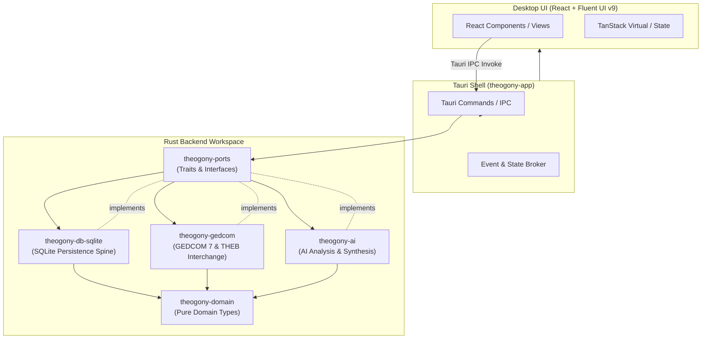

# System Overview

Theogony is a high-performance, local-first genealogy desktop application engineered for rigorous evidence analysis, multi-user interchange, and historical family tree research. Built around a robust Rust backend and a native-feeling React/TypeScript desktop UI via Tauri [repo://theogony-app/Cargo.toml], Theogony separates pure domain logic, persistence, and GEDCOM interchange into discrete workspace crates [repo://Cargo.toml] while guaranteeing ACID-compliant SQLite storage.

## Architectural Boundaries & Data Flow

Theogony follows a strict layered architecture where dependencies flow inward. Pure domain types and ports reside at the center, isolated from database drivers, UI frameworks, and interchange protocols.

---

## Crate Structure

The Rust workspace (`Cargo.toml`) is organized into specialized crates that enforce strict separation of concerns [repo://Cargo.toml]:

1. **`theogony-domain`**
   - **Purpose:** Pure domain models, record structs (`Individual`, `Family`, `Fact`, `Citation`, `SourceDocument`, `Place`, `Repository`), IDs, and error enums.
   - **Invariants:** Zero external data-shape or database dependencies; safe to compile anywhere core data structures are needed.

2. **`theogony-ports`**
   - **Purpose:** Trait definitions and repository interfaces (`TreeRepository`, etc.) defining the boundaries between backend execution logic and storage implementations.

3. **`theogony-db-sqlite`**
   - **Purpose:** ACID-compliant SQLite storage spine (`theogony-db-sqlite`). Implements migration management, versioned schema, high-performance queries, edit logging, and transaction boundaries.

4. **`theogony-gedcom`**
   - **Purpose:** GEDCOM 7 parser, serialization engine, THEB interchange package format (`.tgpkg`), vendor dialect mapping, and conformance test harness.

5. **`theogony-ai`**
   - **Purpose:** Local and remote AI integration helpers, AI override tracking, and ToS state management.

6. **`theogony-app`**
   - **Purpose:** Tauri desktop application entrypoint, command handlers (`commands/`), IPC routing, export/import orchestration, and TypeScript binding generation via `ts-rs` [repo://theogony-app/Cargo.toml].

---

## Local-First Storage, Tauri Commands, and SQLite Backing

Theogony is engineered specifically as a desktop-native application with strong local-first guarantees:

- **Local-First Storage:** Every family tree is stored in a self-contained SQLite database file equipped with WAL mode, foreign key enforcement, and explicit migration paths, ensuring instant local startup, zero server dependency, and robust backup/restore capabilities (`.tgpkg`).
- **Tauri Commands & IPC:** All operations that the UI can perform are defined as plain Rust functions over `AppState` inside `theogony-app/src/commands/` [repo://theogony-app/src/lib.rs]. The macro-driven command system generates Tauri IPC adapters and routing entries from a single source of truth, avoiding drift.
- **SQLite Backing:** The persistence layer (`theogony-db-sqlite`) wraps connections with reader pools and exclusive writer locks, implementing robust transaction management, hypothesis branching, and change history logs.
