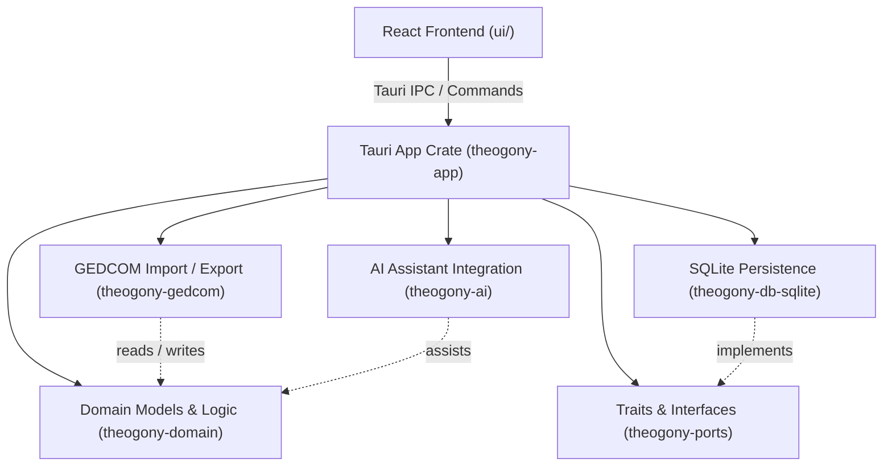

# System Architecture Overview

Theogony is a local-first genealogy desktop application built with a robust multi-tier Rust backend and a modern React frontend. Designed around data ownership, privacy, and genealogical rigor, the application runs entirely offline using Tauri, SQLite, and a domain-driven crate architecture.

This page is part of the OpenWiki documentation hub; for a complete task-routing map of all pages and concepts, consult the [Theogony Quickstart Hub](/openwiki/quickstart.md).

## Core Crate Structure

The Rust workspace (`Cargo.toml`) is partitioned into specialized crates that decouple business logic, database persistence, external interoperability, and application orchestration:

1. **`theogony-domain`**: The foundational pure-Rust core. Defines core genealogical entities (individuals, families, events, facts, notes, citations, sources, repositories), identifiers (`IndividualId`, `FamilyId`, etc.), provenance tracking, and domain validation rules without external database or UI dependencies.
2. **`theogony-ports`**: Defines abstract trait boundaries and interfaces (such as repository traits and edit log ports) that decouple domain services from specific storage engines.
3. **`theogony-db-sqlite`**: The concrete SQLite persistence layer implementing the ports defined in `theogony-ports`. Manages database migrations, transactional repositories, edit logging, time travel / reversion, assertions, branches, and sample data generation.
4. **`theogony-gedcom`**: Handles GEDCOM 5.5.1 / 7 parser and exporter logic, translating hierarchical genealogical text files into domain records and vice versa.
5. **`theogony-ai`**: Integrates local or remote AI capabilities (such as record analysis, transcription assistance, and relationship suggestions) against domain structures.
6. **`theogony-app`**: The Tauri host application crate (`theogony-app`). Manages application state, Tauri commands, IPC bindings, window management, and background initialization.

## Frontend Architecture

Located in `ui/`, the frontend is built using **React**, **Vite**, and TypeScript, communicating with the Rust backend exclusively via asynchronous Tauri IPC commands and event listeners.

- **State Management & API**: Encapsulated in `ui/src/api/` and React context hooks, providing type-safe wrappers around backend Tauri commands.
- **Components & Screens**: Organized into modular screen views (family trees, individual profiles, search, edit histories, settings, and GEDCOM import/export wizard) and reusable UI primitives.

## Local-First Data Flow & Persistence

- **Local Storage**: All family tree databases are stored as local SQLite files (`.theogony` or `.db`), ensuring complete user ownership and zero cloud dependency unless explicitly configured for backup or sync.
- **Transaction & Edit Logging**: Every mutation is captured in an immutable edit log (`theogony-db-sqlite/src/edit_log.rs`), supporting audit trails, undo/redo capabilities, and branch merging.
- **Interoperability**: Users can import and export standard GEDCOM files smoothly via `theogony-gedcom`, bridging standard genealogical archives with Theogony's rich SQLite model.
