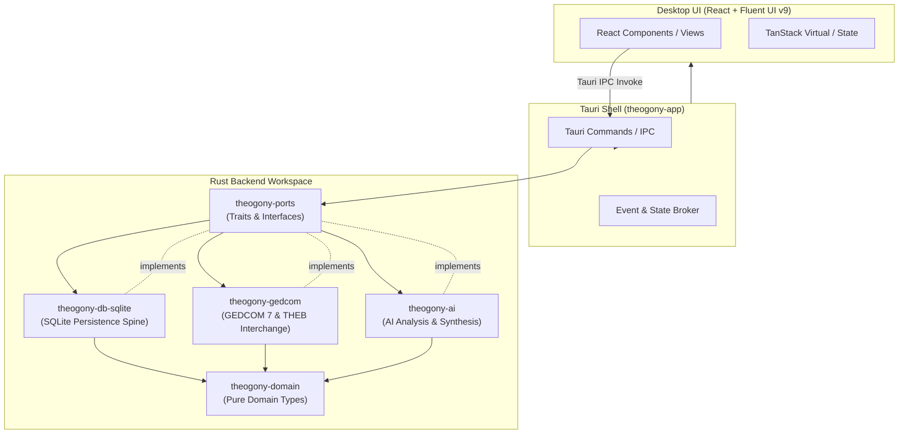

# System Overview & Architecture

Theogony is a high-performance, local-first genealogy desktop application engineered for rigorous evidence analysis, multi-user interchange, and historical family tree research. Built around a robust Rust backend and a native-feeling React/TypeScript desktop UI via Tauri, Theogony separates pure domain logic, persistence, and GEDCOM interchange into discrete crates while guaranteeing ACID-compliant SQLite storage.

## Architectural Boundaries & Data Flow

Theogony follows a strict layered architecture where dependencies flow inward. Pure domain types and ports reside at the center, isolated from database drivers, UI frameworks, and interchange protocols.

---

## Crate Structure

The Rust workspace (`Cargo.toml`) is divided into six specialized crates:

1. **`theogony-domain`**
   - **Purpose:** Pure domain models, record structs (`Individual`, `Family`, `Fact`, `Citation`, `SourceDocument`, `Place`, `Repository`), IDs, and error enums.
   - **Invariants:** Zero external data-shape or database dependencies; safe to compile anywhere data structures are needed.

2. **`theogony-ports`**
   - **Purpose:** Trait definitions and repository interfaces (`TreeRepository`, etc.) defining the boundaries between backend execution logic and storage implementations.

3. **`theogony-db-sqlite`**
   - **Purpose:** ACID-compliant SQLite storage spine (`theogony-db-sqlite`). Implements migration management, versioned schema (`v6+`), high-performance queries, edit logging, and transaction boundaries.

4. **`theogony-gedcom`**
   - **Purpose:** GEDCOM 7 parser, serialization engine, THEB interchange package format (`.tgpkg`), vendor dialect mapping, and conformance test harness.

5. **`theogony-ai`**
   - **Purpose:** Local and remote AI integration helpers, AI override tracking, and ToS state management.

6. **`theogony-app`**
   - **Purpose:** Tauri desktop application entrypoint, command handlers (`commands/`), IPC routing, export/import orchestration, and TypeScript binding generation via `ts-rs`.

---

## Local-First Desktop Application Architecture

Theogony is engineered specifically as a desktop-native application:

- **Desktop Shell (Tauri):** Combines a lightweight Rust binary hosting system state with a modern web frontend.
- **Frontend (`ui/`):** Built with Vite, React, TypeScript, Fluent UI v9, and TanStack Virtual. It provides a dense, native-feeling workspace with dockable panels, tree views, and evidence inspectors. TypeScript bindings in `ui/src/api/generated/` are automatically generated from Rust types using `ts-rs` and checked in CI via `scripts/check-bindings.sh`.
- **Persistence Spine (SQLite):** Each family tree is stored in a self-contained SQLite database file equipped with WAL mode, foreign key enforcement, and explicit migration paths, ensuring instant local startup, zero server dependency, and robust backup/restore capabilities (`.tgpkg`).
