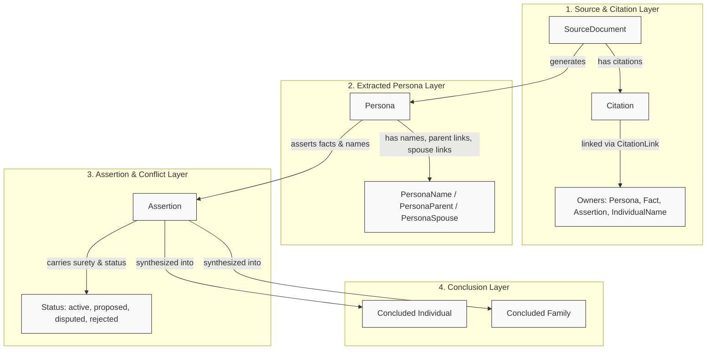

# System Overview & Evidence Architecture

Theogony is a local-first desktop application designed for serious genealogical research, adhering strictly to the Genealogical Proof Standard (GPS) and Elizabeth Shown Mills's *Evidence Explained* methodology. Built around a modular Rust backend workspace and a native-feeling React/TypeScript desktop UI powered by Tauri [repo://theogony-app/Cargo.toml], Theogony cleanly separates pure domain logic, persistence, DNA analysis, AI integration, and GEDCOM interchange into discrete workspace crates [repo://Cargo.toml] while guaranteeing ACID-compliant SQLite storage.

For related concepts and workflows, refer to the [Evidence-First Philosophy](/openwiki/concepts/evidence-first-philosophy.md) and [GEDCOM Portability](/openwiki/integrations/gedcom-portability.md).

## System Architecture

Theogony uses a local-first desktop architecture where a React/TypeScript single-page application runs inside a Tauri webview container, communicating asynchronously with the Rust backend via IPC command handlers. The Rust core orchestrates pure domain evaluation, ACID-compliant SQLite persistence, GEDCOM parsing and export, and DNA segment analysis.

<!-- openwiki: mermaid parse failed and this diagram was converted to a text fence so it does not break rendering. Fix the diagram source and restore the mermaid fence. Parser error: Heuristic: an unescaped angle bracket inside a label breaks rendering; rephrase the label. -->
```text
graph TD
    UI[React TypeScript UI<br>Tauri Webview] -->|Tauri IPC Commands| App[Rust Core App<br>theogony-app]
    App --> Domain[Domain and Evidence Engine<br>theogony-domain]
    App --> DB[SQLite Persistence Layer<br>theogony-db-sqlite]
    App --> Gedcom[GEDCOM Interchange<br>theogony-gedcom]
    App --> DNA[DNA Analysis and Kits<br>theogony-dna]
    DB --> File[(Local SQLite Database)]
```

## The Evidence-First Philosophy and Data Hierarchy

The defining characteristic of Theogony's architecture is its **Evidence-First data pipeline**. Rather than treating genealogy as a set of mutable entity records where users overwrite dates or parent links directly, the system enforces a strict four-tier hierarchy moving from uninterpreted historical artifacts to conclusive historical individuals:


```mermaid
graph TD
    subgraph Sources ["1. Source & Citation Layer"]
        SD[SourceDocument] -->|has citations| Cit[Citation]
        Cit -->|linked via CitationLink| CL[Owners: Persona, Fact, Assertion, IndividualName]
    end

    subgraph Personas ["2. Extracted Persona Layer"]
        SD -->|generates| P[Persona]
        P -->|has names, parent links, spouse links| PN[PersonaName / PersonaParent / PersonaSpouse]
    end

    subgraph Assertions ["3. Assertion & Conflict Layer"]
        P -->|asserts facts & names| Ass[Assertion]
        Ass -->|carries surety & status| Status[Status: active, proposed, disputed, rejected]
    end

    subgraph Conclusions ["4. Conclusion Layer"]
    classDef default fill:#f9f9f9,stroke:#333,stroke-width:1px;
        Ass -->|synthesized into| Ind[Concluded Individual]
        Ass -->|synthesized into| Fam[Concluded Family]
    end
```

1. **Source Documents & Citations (`SourceDocument`, `Citation`)**: Physical or digital archival records, census returns, books, repositories, and DNA test kits with detailed citation references [repo://theogony-domain/src/records.rs#L343-L353].
2. **Extracted Personas (`Persona`)**: Unlinked historical actors as they appear within specific source documents (e.g., John Smith appearing across multiple censuses or deeds) [repo://theogony-domain/src/records.rs#L343-L353].
3. **Assertions (`Assertion`)**: Specific claims made by a persona or source regarding facts or names, carrying explicit surety ratings and operational statuses (`active`, `proposed`, `disputed`, `rejected`) [repo://theogony-domain/src/records.rs#L1006-L1028].
4. **Concluded Individuals and Families (`Individual`, `Family`)**: Canonical historical individuals and family units established by synthesizing and correlating underlying assertions across multiple sources [repo://theogony-domain/src/records.rs#L532-L538].

### Non-Destructive Conflict Handling

Genealogical research frequently uncovers conflicting evidence (e.g., differing birth years in successive censuses or competing parentage claims). Theogony handles contradictions non-destructively:
- **Operational Statuses**: Assertions, persona-parent links, and persona-spouse links support status values such as `active`, `disputed`, `rejected`, and `proposed` [repo://theogony-domain/src/records.rs#L495-L524, repo://theogony-domain/src/records.rs#L1006-L1022].
- **Conflict Retention**: Contradictory evidence is marked as `disputed` or `rejected` rather than being deleted or overwritten, allowing researchers to evaluate competing hypotheses side-by-side with complete audit trails.

## Workspace Crate Structure

The Rust backend is structured as a Cargo workspace separating concerns into dedicated crates:

- **`theogony-domain/`**: Pure domain records, strongly typed identifiers, provenance models, DNA bucketing, relationship calculations, WATO models, and error types with zero external storage or persistence dependencies [repo://theogony-domain/src/lib.rs#L1-L48].
- **`theogony-db-sqlite/`**: ACID-compliant SQLite persistence implementation supporting WAL mode, foreign key enforcement, versioned schema migrations, hypothesis branching, and transaction/edit history logs [repo://theogony-db-sqlite/Cargo.toml, repo://theogony-db-sqlite/src/schema.rs].
- **`theogony-app/`**: Tauri desktop application container, command handlers, application state orchestration, diagnostics, backup management, and evidence management operations [repo://theogony-app/Cargo.toml, repo://theogony-app/src/lib.rs].
- **`theogony-gedcom/`**: Parser and exporter supporting GEDCOM 5.5.1 and GEDCOM 7 interchange standards [repo://theogony-gedcom/Cargo.toml].
- **`theogony-ports/`**: Core port traits defining repository interfaces and adapters [repo://theogony-ports/Cargo.toml].
- **`theogony-dna/`**, **`theogony-haplogroup/`**, **`theogony-ai/`**: Specialized crates providing DNA segment clustering, WATO analysis, Y-STR markers, haplogroup classification, and AI assistant integration.
- **`ui/`**: React, TypeScript, and Tailwind CSS frontend built with Vite, featuring rich interactive components (such as pedigree canvas, family views, data grids) and report generation engines (Ahnentafel, family group sheets, citation reports, and place reports) communicating via Tauri IPC commands [repo://ui/package.json, repo://ui/src/components/PedigreeCanvas.tsx, repo://ui/src/reports/CitationReports.tsx].
