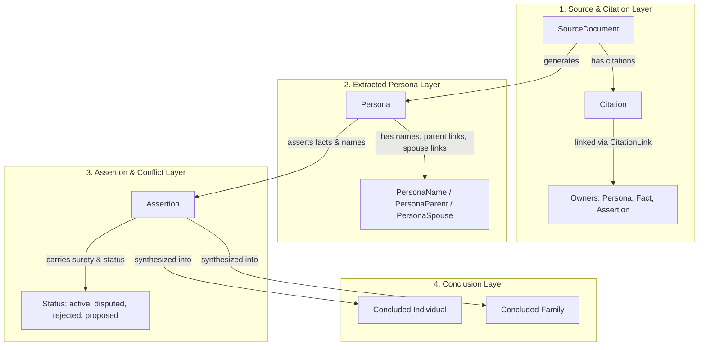

# Evidence-First Philosophy & GPS Standards

Theogony is built upon an **evidence-first genealogical model** inspired by Elizabeth Shown Mills's *Evidence Explained* methodology and the **Genealogical Proof Standard (GPS)** formulated by the Board for Certification of Genealogists (BCG). Rather than treating a family tree as a collection of mutable entity records where users overwrite birth dates or parent links directly, Theogony strictly separates raw source documents, extracted actors (*personas*), asserted claims, and concluded historical individuals and families.

---

## The Evidence-First Data Model Hierarchy

The data architecture moves deliberately from uninterpreted historical artifacts to conclusive genealogical conclusions across four primary layers:

1. **Source Documents & Citations (`SourceDocument`, `Citation`)**
   - Represents physical or digital archival records, books, census pages, vital records, or DNA test kits.
   - Each source document contains specific citations (page references, transcriptions, and footnote texts) linked to assertions, facts, or personas via citation links.

2. **Extracted Personas (`Persona`, `PersonaName`, `PersonaParent`, `PersonaSpouse`)**
   - Represents an unlinked individual as they appear within a specific source document.
   - A single historical person (e.g., John Smith) might appear across multiple census returns, land deeds, and marriage certificates, generating multiple distinct `Persona` records in the database.
   - Personas capture names, reported sexes, parent links, and spouse links as stated *in that specific source document*.

3. **Assertions (`Assertion`)**
   - Represents specific claims made by a persona or source regarding facts (birth, death, residence, occupation) or names.
   - Assertions carry explicit **surety** ratings (e.g., primary, secondary, questionable) and operational **status** attributes.

4. **Concluded Individuals and Families (`Individual`, `Family`)**
   - Represents the genealogist's synthesized conclusions—the canonical historical individuals and family units established by exhaustively analyzing and correlating underlying assertions across multiple sources.

---

## Non-Destructive Conflict Handling

Genealogical research frequently encounters contradictory evidence—such as conflicting birth years across successive censuses or competing parentage claims. Traditional software often forces users to overwrite data or delete alternatives. Theogony implements **non-destructive conflict handling**:

- **Status Vocabulary:** Assertions, persona-parent links, and persona-spouse links support four discrete operational statuses:
  - `active`: Currently accepted evidence supporting a conclusion.
  - `disputed`: A conflicting claim that challenges an existing conclusion or active assertion, retained for transparent analysis rather than deleted.
  - `rejected`: A claim evaluated and formally rejected under GPS scrutiny.
  - `proposed`: Hypothesis or AI-suggested claims awaiting review.
- **Audit Trails:** All modifications are recorded in immutable edit logs and revision structures, ensuring complete traceability of analytical decisions without destroying competing claims.

---

## The Genealogical Proof Standard (GPS)

To establish reliable genealogical conclusions, Theogony's architecture supports the five pillars of the **Genealogical Proof Standard**:

1. **A reasonably exhaustive search** for all available sources that could contain information about each identity or event.
2. **Complete and accurate citations** of every source used (`SourceDocument`, `Citation`).
3. **Thorough analysis and correlation** of the collected evidence (supported by `Assertion` statuses, surety levels, and persona linking).
4. **Resolution of conflicting evidence** (supported by non-destructive `disputed` and `rejected` states rather than silent overwrites).
5. **A soundly reasoned, written conclusion** explaining how the evidence proves the identity, relationship, or event.
