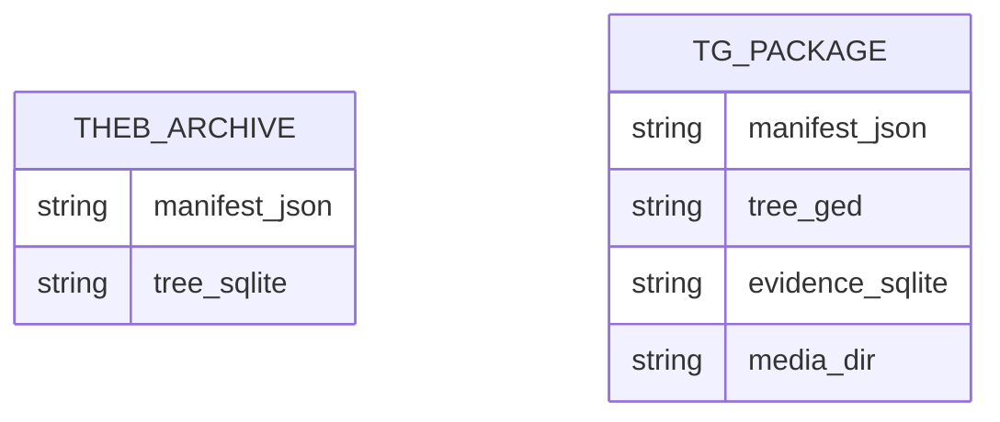

# Backups and Data Packages

Theogony provides two distinct portability and preservation mechanisms: **Database Backups** (`.theb`) for complete, disaster-recovery snapshots of local SQLite state, and **Lossless Portability Packages** (`.tgpkg`) for GEDCOM-7 compatible collaborative interchange carrying rich provenance, evidence SQLite databases, and media files.

## Overview & Architecture

| Format | File Extension | Archive Type | Primary Purpose | Compatibility |
| :--- | :--- | :--- | :--- | :--- |
| **Database Backup** | `.theb` | Gzipped Tar (`.tar.gz`) | Disaster recovery, local migration, crash-safe state snapshot | Theogony-exclusive binary snapshot |
| **Portability Package** | `.tgpkg` | ZIP (GEDZIP compatible) | Inter-app sharing, collaborative exchange, rich attribution | GEDZIP-compliant readers (`tree.ged`), full fidelity in Theogony (`evidence.sqlite`) |

---

## Database Backups (`.theb`)

A `.theb` backup represents a complete point-in-time snapshot of a local Theogony tree. It ensures that users can preserve exact database states, including internal identifiers, branch hypotheses, and revision histories.

### Internal Structure

Inside the gzipped tar archive (`.tar.gz`), two core files reside at the root level:
1. `manifest.json`: Metadata about the backup and schema (`schema_version`, `app_version`, `tree_lineage_id`, `tree_copy_id`).
2. `tree.sqlite`: A live binary snapshot of the SQLite database.

*Structure of `.theb` database backups and `.tgpkg` lossless portability packages.*

### Export Mechanism (`export_theb`)

1. **Snapshot Generation**: Uses the SQLite Online Backup API via `theogony_db_sqlite`'s `export_theb_snapshot` to capture a consistent state without locking out active readers.
2. **Manifest Assembly**: Gathers current `schema_version`, `app_version`, `tree_lineage_id`, and `tree_copy_id` from the repository and writes `manifest.json`.
3. **Atomic File Replacement**: Writes the archive to a temporary file (`.theb.tmp`) beside the destination path. If disk full or other errors occur, the temporary file is removed and any pre-existing backup at the destination remains untouched. Upon success, it performs an atomic `rename` into place.

### Restore Mechanism (`restore_theb`)

Restoring a `.theb` backup adheres to strict safety guarantees:
- **New Tree Only**: A restore always creates a brand-new tree file. It refuses to overwrite an existing tree file, its WAL (`-wal`), or SHM (`-shm`) sidecars, preventing accidental data loss or clobbering active databases.
- **Pre-flight Validation**: Unpacks the archive into a temporary directory, validates that both `manifest.json` and `tree.sqlite` exist, and parses the manifest.
- **Forward Schema Compatibility**: Inspects the SQLite database against supported migrations (`migrate::inspect`) before touching the destination path. If the backup schema is too new, it fails immediately, guaranteeing that a rejected restore creates nothing.
- **Copy ID Collision Detection**: Checks if any other known recent tree or currently open tree on the machine carries the exact same `tree_copy_id`. If a collision is detected, it automatically regenerates the tree copy ID to preserve uniqueness across clones.

---

## Lossless Portability Packages (`.tgpkg`)

The `.tgpkg` package format implements the GEDCOM-7 GEDZIP standard while adding an embedded SQLite evidence database and internal manifest to ensure zero loss of scholarly provenance, source-to-fact citations, and repository metadata.

### Internal Structure

A `.tgpkg` file is a valid ZIP archive containing:
- `manifest.json`: Package metadata, version details, and whether the package is a `full` export or a `delta` relative to a baseline exchange.
- `tree.ged`: GEDCOM-7 formatted genealogical text generated from the database.
- `evidence.sqlite`: A serialized snapshot of the evidence and source repository tables.
- `media/`: A directory for attached media files.

### Package Export (`export_package`)

Users initiate package export via **Export Package** in the UI, optionally toggling **Exclude Private** records and supplying a **Contributor Label**.
- **GEDCOM Generation**: Assembles export documents adhering to GEDCOM-7 standards (see [GEDCOM Portability & Interchange](gedcom-portability.md) for details on AST mapping and extension tag handling).
- **Evidence Snapshot**: Exports a snapshot of the evidence database, omitting private citations if requested.
- **ZIP Packaging**: Packages all components using deflate compression into the destination `.tgpkg` path.

### Package Import & Baseline Deltas

When importing a package via **Restore Backup** or import routines:
- **Full Packages**: Unpack into a new tree repository with full validation and schema checks.
- **Delta Packages**: Contain changes relative to a previous baseline exchange (`baseline_copy_id`). The system computes deltas and presents a `PackagePreview` showing individual counts, source document counts, and contributor labels before applying updates.

---

## Verification & Best Practices

1. **Package Verification**: Always verify `.theb` archives and `.tgpkg` packages by running pre-flight inspections and manifest integrity checks before opening or restoring.
2. **Atomic Writes**: Backup routines utilize temporary sidecar files and atomic renames to prevent partial writes during disk-full or interruption events.
3. **Copy ID Uniqueness**: When restoring backups or merging packages, ensure that `tree_copy_id` collisions are handled by regenerating IDs when conflicts arise with existing local trees.
