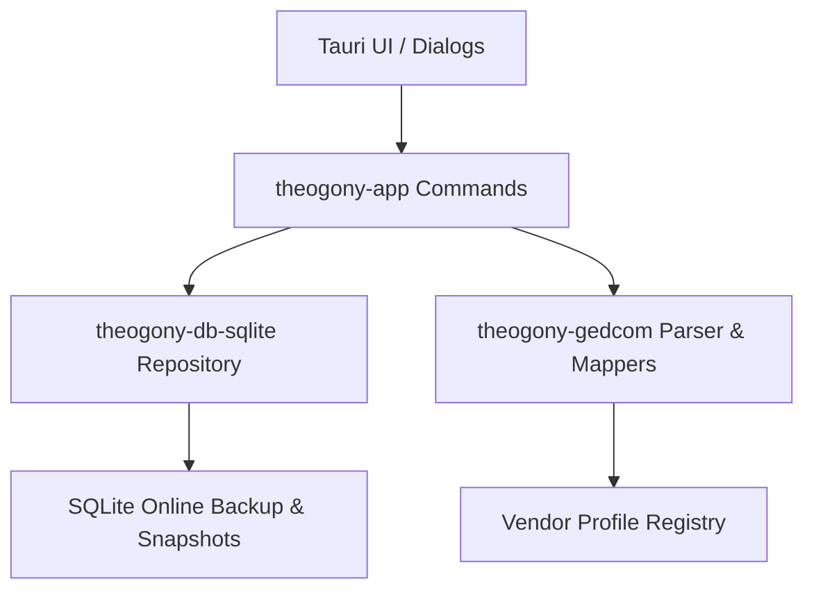

# Data Portability & GEDCOM Interchange

Theogony implements a robust, multi-tier data portability architecture designed to ensure zero data loss when moving genealogical data between Theogony and other desktop software, web services, or collaborative partners. Interchange spans four primary mechanisms:

1. **Standard GEDCOM 5.5.1 and GEDCOM 7 Export & Import** (`.ged`): Plain textual genealogy files.
2. **Lossless Data Packages** (`.tgpkg`): GEDZIP-compliant ZIP archives containing `tree.ged`, `evidence.sqlite` (complete evidentiary provenance), `manifest.json`, and media attachments (`media/`).
3. **Complete Database Backups** (`.theb`): Compressed tar+gzip archives (`tree.sqlite` plus `manifest.json`) created via SQLite's Online Backup API.
4. **Vendor Extension Tag Preservation**: Intelligent multi-tier mapping that detects source vendor software signatures and maps proprietary extension tags into canonical fact types.

---

## 1. Architecture & Ownership Boundaries

Portability is divided into three architectural layers to maintain clean separation of concerns:

- **`theogony-gedcom`**: A pure parsing, serialization, and mapping crate. It parses GEDCOM text into `GedcomDocument` structures, runs vendor signature detection, computes fact-type drafts for extension tags, and maps between domain export shapes and GEDCOM records. It contains **no database access** and knows nothing about SQLite or Tauri.
- **`theogony-db-sqlite`**: Handles SQLite storage, schema migrations (`migrations::ALL`), and online backup/snapshot routines (`export_theb_snapshot`, `export_snapshot`).
- **`theogony-app`**: Tauri command handlers (`crate::commands::interchange`, `crate::commands::backup`) that bridge the live database (`TreeRepository`) with pure export/import documents, orchestrating transaction boundaries, file locks, and temp-file renaming.

---

## 2. Standard GEDCOM 5.5.1 and GEDCOM 7 Interchange (`.ged`)

Plain GEDCOM interchange supports both legacy **GEDCOM 5.5.1** and modern **GEDCOM 7** (`repo://theogony-app/src/commands/interchange/plain_ged.rs`).

### Export (`ExportGed`)
- **Document Assembly**: `gather_export_document` queries the active `TreeRepository` to collect individuals, family units, and source documents, translating internal structures into `ExportDocument` (`repo://theogony-app/src/commands/interchange/assemble.rs`).
- **Sex Normalization**: Translates UI-level `"Male"` and `"Female"` strings into standard GEDCOM `1 SEX M` and `1 SEX F` tags (`repo://theogony-app/src/commands/interchange/assemble.rs#L24-L30`).
- **Custom Fact Fallback**: If a fact type lacks a standard `gedcom_tag`, it is exported as a generic GEDCOM event (`1 EVEN`) with a `2 TYPE <FactTypeName>` substructure rather than being dropped (`repo://theogony-gedcom/src/mapper/export.rs#L17-L22`).
- **Serialization**: `theogony_gedcom::mapper::export::build(&export_doc).serialize()` emits strictly formatted GEDCOM text.

### Import (`ImportGed`)
- **Parsing**: Reads the source file and parses it via `GedcomDocument::parse(&text)` (`repo://theogony-app/src/commands/interchange/plain_ged.rs#L79-L80`).
- **Vendor Detection & Fact Drafting**: Detects the originating software vendor and generates required `FactTypeDraft` definitions for any unrecognized extension tags before creating the target tree database (`repo://theogony-app/src/commands/interchange/plain_ged.rs#L85-L91`).
- **Unsourced Persona Routing**: Facts and assertions lacking explicit source citations are routed through a synthetic "Imported GEDCOM, no source cited" persona to maintain evidentiary auditability.

---

## 3. Lossless Data Packages (`.tgpkg`)

`.tgpkg` files are real ZIP archives (fully GEDZIP-compliant) designed for peer-to-peer tree sharing where evidentiary rigor must be preserved alongside genealogical structure (`repo://theogony-app/src/commands/interchange/package.rs`).

### Archive Structure
- `manifest.json`: Carries `schema_version`, `app_version`, `tree_lineage_id`, `tree_copy_id`, `exported_at`, `contributor_label`, and `kind` (`PackageKind::Full` or `PackageKind::Delta`).
- `tree.ged`: Standard GEDCOM 7 representation of individuals and families (enabling non-Theogony genealogy software to read the tree).
- `evidence.sqlite`: A complete, self-contained SQLite snapshot of the evidentiary database (sources, repositories, citations, assertions, and agent confidence ratings). Per the GEDZIP specification, tools unaware of Theogony's evidentiary schema simply ignore this file.
- `media/`: Directory for attached media files and digital artifacts.

### Import Safety & Workflow
1. **Upfront Validation**: Archives are inspected via `zip_entries` to verify required entries (`manifest.json`, `evidence.sqlite`, `tree.ged`) (`repo://theogony-app/src/commands/interchange/package.rs#L163-L200`).
2. **Schema Compatibility**: Schema migrations are inspected (`migrate::inspect`) on the temporary evidence snapshot *before* touching the user's destination path, ensuring rejected imports leave no residue (`repo://theogony-app/src/commands/interchange/package.rs#L231`).
3. **Full vs. Delta Handling**: Full packages instantiate a new tree database at `dest_path`. Delta packages contain incremental assertion updates relative to a baseline `tree_copy_id` and display a preview (`PackagePreview`) summarizing individual and source document counts.

---

## 4. Complete Database Backups (`.theb`)

`.theb` files are compressed tar+gzip archives providing instantaneous, lossless snapshots of a Theogony database (`repo://theogony-app/src/commands/backup.rs`).

### Export Workflow
1. **Online Backup API**: `repo.export_theb_snapshot(&temp_sqlite)` uses SQLite's Online Backup API to safely capture a live database snapshot without locking out active readers or writers (`repo://theogony-app/src/commands/backup.rs#L74`).
2. **Manifest Inclusion**: Bundles `tree.sqlite` with `manifest.json` containing `schema_version`, `app_version`, `tree_lineage_id`, `tree_copy_id`, and `exported_at`.
3. **Atomic Replacement**: Archives are written to a temporary staging file (`.theb.tmp`) and renamed into place only upon successful completion. A failed disk write never overwrites or corrupts an existing valid backup.

### Restore Safety
Restore (`RestoreTheb`) validates the archive manifest and forward schema compatibility *before* initializing the destination path, guarding against database corruption or incompatible schema versions.

---

## 5. Vendor Extension Tag Preservation

Genealogy software frequently uses proprietary extension tags (e.g., Ancestry, RootsMagic, Family Tree Maker, Gramps). Theogony preserves these through a multi-tier resolution strategy (`repo://theogony-gedcom/src/vendor/mod.rs` and `repo://theogony-gedcom/src/mapper/naming.rs`):

1. **Tier 1 (Standard Tags)**: Standard GEDCOM 5.5.1 / 7 tags (`BIRT`, `DEAT`, `MARR`, etc.) map directly to built-in fact types.
2. **Tier 2 (Vendor Signature & Tag Tables)**: `detect_vendor` inspects `HEAD.SOUR` and child tags (`NAME`, `VERS`, `CORP`) against a prioritized `REGISTRY` of known vendor profiles (`repo://theogony-gedcom/src/vendor/mod.rs#L57-L71`). Matched extension tags (such as RootsMagic's `_MILT` or custom military tags) resolve to canonical fact types (`canonical_names::MILITARY_SERVICE`, `HAS_PHOTO`, etc.) via centralized mapping tables.
3. **Tier 3 (Event Type Fallback)**: Unrecognized `EVEN` or `FACT` tags with a `2 TYPE <Value>` substructure adopt the specified type name (`repo://theogony-gedcom/src/mapper/naming.rs#L43-L50`).
4. **Tier 4 (Mechanical Fallback)**: Any remaining custom extension tags (e.g., `_DIT_NAME`, `_UID`) are processed via `mechanical_name_for_tag`: leading underscores are stripped, remaining underscores and dots are converted to word breaks, and words are title-cased (`_DIT_NAME` → `"Dit Name"`). This guarantees zero data loss: every custom tag becomes a valid fact type rather than falling back to unsearchable raw notes (`repo://theogony-gedcom/src/mapper/naming.rs#L14-L22`).
