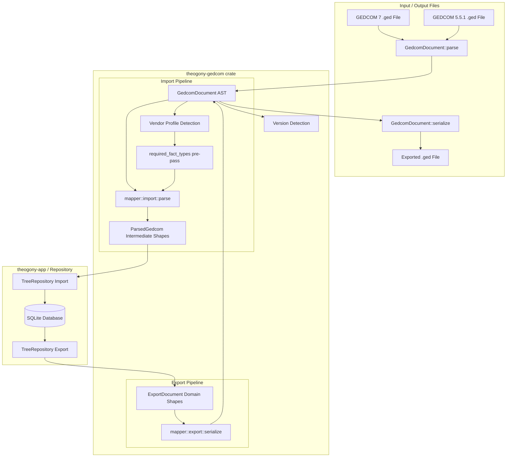

# GEDCOM Portability & Interchange

Theogony provides robust bidirectional portability and interchange for standard GEDCOM files (`.ged`) supporting both **GEDCOM 5.5.1** and **GEDCOM 7**. Portability is engineered as a pure, database-free translation boundary located in the `theogony-gedcom` crate, decoupled from SQLite storage via hexagonal architecture principles.

## Architecture & Pipeline

The GEDCOM portability pipeline handles parsing, version detection, vendor extension mapping, pre-parsing draft discovery, domain importing, and domain exporting.

## GEDCOM Versions Supported

`GedcomDocument::version()` inspects the header record (`HEAD.GEDC.VERS`) to distinguish file standards:
- **GEDCOM 5.5.1**: Traditional standard widely supported across desktop genealogy applications.
- **GEDCOM 7**: Modern specification (starting with `7.`) eliminating the legacy line-length limits and `CONC` continuation syntax.
- **Other**: Unrecognized version strings are preserved as `GedcomVersion::Other` rather than rejected outright.

During serialization, long string values are split into standard `CONT` continuation lines on embedded newlines. `CONC` is never emitted because GEDCOM 7 eliminated line length limits, and GEDCOM 5.5.1 parsers reliably handle `CONT`.

## Vendor Extension Tag Handling & Resolution Tiers

Genealogy software vendors (such as RootsMagic, Legacy Family Tree, or Family Tree Maker) frequently store custom data using proprietary or user-defined extension tags (beginning with underscores like `_MILT` or custom `EVEN` events). Theogony resolves extension tags using a robust **4-tier resolution order** implemented in `theogony-gedcom/src/mapper/naming.rs`:

1. **Tier 1 (Standard Tags)**: Recognizes standard GEDCOM tags (e.g., `BIRT`, `DEAT`, `MARR`) mapped directly to built-in fact types.
2. **Tier 2 (`EVEN` / `FACT` Subtypes)**: When encountering generic `EVEN` or `FACT` records, Theogony inspects the nested `TYPE` substructure (e.g., `1 EVEN\n2 TYPE Eye Color`) and uses that name verbatim.
3. **Tier 3 (Vendor Profiles)**: If the file header (`HEAD.SOUR`) matches a registered genealogy software vendor profile (`detect_vendor`), Theogony consults the vendor's specific tag-mapping table (`VendorProfile::tag_map()`) to translate proprietary tags into canonical fact names (e.g., mapping `_MILT` to "Military Service").
4. **Tier 4 (Mechanical Cleanup Fallback)**: For any unrecognized extension tag (e.g., `_DIT_NAME`, `_UID`), Theogony applies universal mechanical cleanup:
   - Strips leading underscore(s).
   - Replaces any remaining underscores (`_`) or dots (`.`) with word boundaries.
   - Applies title casing to each word (e.g., `_DIT_NAME` becomes `"Dit Name"`, `_UID` becomes `"Uid"`).

This tier system guarantees that **no proprietary data is ever dropped** or downgraded to raw unstructured notes; every custom tag successfully resolves to a structured fact type.

### Pre-Parse Fact Type Drafting

Before importing a document into the active repository, `theogony-gedcom::mapper::drafts::required_fact_types` performs a pre-parse scan across all records using the exact same naming rules. It returns missing `FactTypeDraft` definitions. `theogony-app` then creates any missing fact types in the database prior to invoking `mapper::import::parse()`. If a tag resolves to a name absent from the supplied fact types list, import panics rather than failing silently.

## Invariants, Failure Semantics & Testing

- **Database Independence**: The `theogony-gedcom` crate contains zero database dependencies (no `rusqlite`). All database operations occur in `theogony-app` or persistence layers, preserving hexagonal isolation.
- **Empty Document Rejection**: Parsing an empty string returns `GedcomError::Empty`.
- **Round-Trip Fidelity**: Serialization and parsing preserve AST structure, cross-references (`xref`), notes, and hierarchical parent-child tags.
