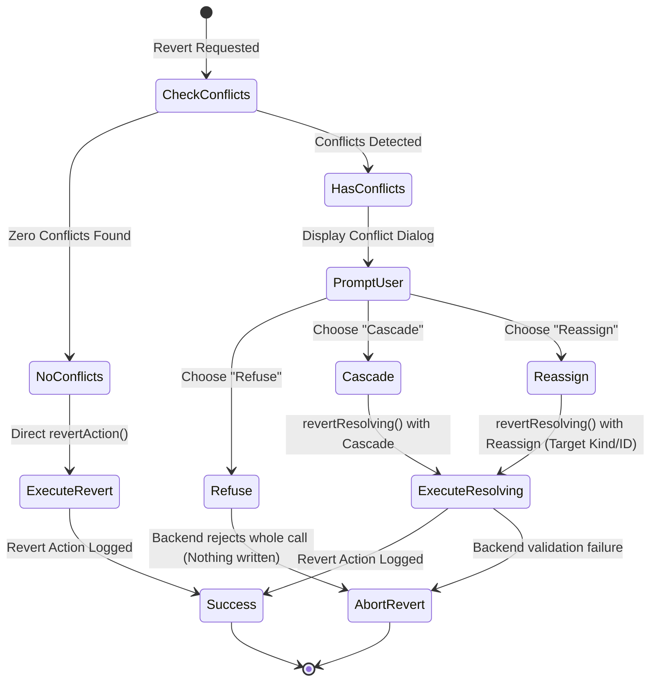

# Review Queue & Audit History

OpenWiki and its underlying domain engine enforce rigorous evidence-first data integrity (`repo://openwiki/concepts/evidence-first-philosophy.md`). Because genealogical data often arrives from disparate GEDCOM imports, multi-archive extractions, and manual annotations, records can occasionally become unattached or multi-cited. The **Review Queue** (`repo://theogony-app/src/commands/review.rs`, `repo://ui/src/screens/ReviewQueue.tsx`) provides dedicated workflows to inspect and resolve these hygiene issues, while the **Edit History** (`repo://theogony-app/src/commands/history.rs`, `repo://ui/src/components/HistoryPanel.tsx`) and **Selective Revert** engine offer full auditability, conflict checking, and safe undo capabilities (`repo://ui/src/components/RevertDialog.tsx`).

---

## 1. The Review Queue and Data Hygiene

The Review Queue helps researchers monitor and clean up entity relationships across core domain sections:

1. **Unattached Personas**: Floating personas that have not yet been linked to a conclusion person. Researchers can inspect their claims and sources, and click **Attach…** (`repo://ui/src/components/AttachPersonaDialog.tsx`) to link them to an individual or create a new blank person. When attached, all assertions currently held by the persona are updated in a single atomic transaction (`log_action`) to carry the link (`repo://theogony-app/src/commands/review.rs#L176-L221`). If the persona has no existing assertions, a minimal `persona_name` assertion is created to hold the attachment.
2. **Cited by Multiple Sources**: Personas whose evidence spans multiple source documents (`repo://theogony-app/src/commands/review.rs#L255-L302`). Researchers review these entries to determine whether citations represent independent corroboration or duplicate extractions.
3. **Date Issues**: Chronological inconsistencies or questionable lifecycle dates flagged for review (`repo://theogony-app/src/commands/review.rs`, `repo://ui/src/screens/ReviewQueue.tsx`), which researchers can dismiss if verified as valid historical variance.
4. **Merge People**: A manual search-and-pick merge tool where researchers select two individual records (Person A and Person B) via `PersonPicker` components, compare their attributes in the `MergeDialog`, and merge them.

---

## 2. Edit History and Audit Trail

Every modification in the system is recorded in an immutable append-only edit log (`repo://ui/src/components/HistoryPanel.tsx`, `repo://theogony-app/src/commands/history.rs`). 

- **Virtualized Grid & Cursor Pagination**: The history panel displays actions using cursor pagination over `history_actions` and total counts via `history_count`.
- **Operation Detail Pane**: Selecting any action loads its underlying low-level field operations (`history_ops`), showing the exact sequence of changes (`op.seq`), operation summaries (`op.kind` and `op.target_kind`), and the before/after JSON states (`op.before`, `op.after`).
- **Reverted Status**: Actions that have been undone are visually marked as `(reverted)` via `action.reverted_by`.

---

## 3. Selective Revert and Conflict Resolution

When a researcher initiates a revert on a historical action (`repo://ui/src/components/RevertDialog.tsx`, `repo://theogony-app/src/commands/history.rs`), the system checks for conflicts (`revert_conflicts`) to ensure subsequent edits are not silently corrupted or broken.

### Conflict State Transition Logic

If downstream edits conflict with the intended revert (e.g. a later action modified a field or attached dependent data that the revert would delete), the revert enters a two-step resolution dialog. Each conflict must be resolved using one of three strategies:

### Resolution Options
- **Refuse**: Aborts the revert entirely if any conflict is unresolved (Refuse is the default; partial applies are never permitted).
- **Cascade**: Automatically includes and reverts the blocking downstream action (`conflict.blocking_action`).
- **Reassign**: Reassigns the target of the field modification to a different specified record (`target_kind` and `target_id`), copying the value from that alternate row.
