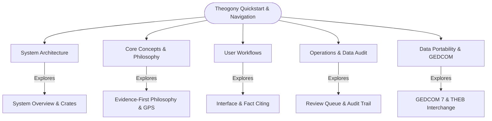

# Theogony Quickstart & Navigation Guide

Welcome to the **Theogony OpenWiki**! This quickstart serves as the central navigation map and task-routing hub for understanding Theogony—a high-performance, local-first genealogy desktop platform engineered for rigorous evidence analysis, multi-user interchange, and historical family tree research.

Whether you are a genealogist exploring user workflows, a researcher studying the Genealogical Proof Standard (GPS), or a developer diving into the Tauri and Rust backend architecture, this guide directs you to the core documentation domains.

---

## Navigation Guide & Task-Routing Map

---

## Major Wiki Domains

### 1. Architecture & System Design
- **[System Overview & Architecture](/openwiki/architecture/system-overview.md):** High-level architectural overview of Theogony's local-first genealogy platform, workspace crate layout (`theogony-domain`, `theogony-ports`, `theogony-db-sqlite`, `theogony-gedcom`, `theogony-dna`, `theogony-ai`, `theogony-app`), Tauri desktop shell, and persistence spine [repo://Cargo.toml, repo://theogony-app/Cargo.toml].

### 2. Concepts & Methodology
- **[Evidence-First Philosophy & GPS Standards](/openwiki/concepts/evidence-first-philosophy.md):** Core philosophical framework and Genealogical Proof Standard (GPS) implementation in Theogony, detailing the four-layer hierarchy separating source documents, extracted personas, asserted claims, and concluded historical individuals and families [repo://theogony-domain/src/lib.rs].

### 3. User Workflows
- **[Core User Workflows](/openwiki/workflows/user-workflows.md):** Step-by-step user guidance on navigating the OpenWiki and application interface, recording and citing historical facts, assigning surety ratings, and structuring family relationships.

### 4. Operations & Data Hygiene
- **[Data Hygiene: Review & Audit](/openwiki/operations/review-and-audit.md):** Detailed documentation of the Review Queue, unattached persona resolution, edit history, and selective revert mechanisms ensuring absolute data integrity.

### 5. Integrations & Portability
- **[Data Portability & GEDCOM Interchange](/openwiki/integrations/gedcom-portability.md):** Comprehensive guide on data import/export, GEDCOM 5.5.1/7 support, THEB archive packages (`.tgpkg`), database backups, and lossless data interchange.

---

## Quick Tasks & Common Entrypoints

- **I want to understand how data is stored and processed locally:** Read [System Overview & Architecture](/openwiki/architecture/system-overview.md).
- **I want to learn how source citations map to historical conclusions:** Read [Evidence-First Philosophy & GPS Standards](/openwiki/concepts/evidence-first-philosophy.md).
- **I want to navigate the application and add cited facts:** Read [Core User Workflows](/openwiki/workflows/user-workflows.md).
- **I want to clean up unattached personas and review audit histories:** Read [Data Hygiene: Review & Audit](/openwiki/operations/review-and-audit.md).
- **I want to import or export GEDCOM files and package archives:** Read [Data Portability & GEDCOM Interchange](/openwiki/integrations/gedcom-portability.md).
