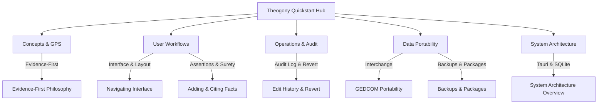

# Theogony Quickstart Guide

Welcome to **Theogony**, a local-first desktop genealogy application built with Tauri, React, and SQLite, adhering strictly to the Genealogical Proof Standard (GPS). 

This quickstart serves as the central task-routing hub for users, family history researchers, and developers exploring the documentation and features of Theogony.

---

## What is Theogony?

Theogony is engineered for rigorous genealogical research. Unlike traditional tree-building software that conflates raw historical records with final conclusions, Theogony implements an **Evidence-First Philosophy**. It preserves the distinction between:
1. **Source Documents**: Original or derivative historical records.
2. **Extracted Personas**: Abstracted individuals mentioned in specific documents.
3. **Assertions**: Individual claims (birth, marriage, residence) tied to citations and surety ratings.
4. **Concluded Individuals and Families**: Synthesized genealogical entities formed by correlating multiple assertions.

All data is stored locally in an encrypted or standard SQLite database, guaranteeing complete data sovereignty and privacy.

---

## Documentation Task-Routing Map

Use the table below to navigate directly to the concepts, workflows, data portability guides, operations, and architecture pages within the OpenWiki documentation.

| Category | Page Title & Description | Target Audience | Direct Link |
| :--- | :--- | :--- | :--- |
| **Architecture** | **System Architecture Overview**: High-level technical overview of Theogony's local-first architecture, Tauri backend, SQLite storage, and crate organization. | Developers & Power Users | [System Architecture Overview](/openwiki/architecture/system-overview.md) |
| **Concepts** | **Evidence-First Philosophy & GPS Standards**: Explains how Theogony implements the Genealogical Proof Standard through structured evidence correlation. | Researchers & Users | [Evidence-First Philosophy](/openwiki/concepts/evidence-first-philosophy.md) |
| **Workflows** | **Navigating the Interface**: Guides users through the main user interface components and layout of Theogony. | New Users | [Navigating the Interface](/openwiki/workflows/navigating-the-interface.md) |
| **Workflows** | **Adding and Citing Facts**: Step-by-step instructions for recording genealogical assertions with surety ratings and citations. | Researchers & Users | [Adding and Citing Facts](/openwiki/workflows/adding-and-citing-facts.md) |
| **Workflows** | **Navigating the Interface** *(Interface & Controls)*: Detailed component reference for the Tree Navigator, Details Panel, Person Picker, and Review Queue. | Researchers & Users | [Navigating the Interface](/openwiki/workflows/navigating-the-interface.md) |
| **Operations** | **Edit History & Selective Revert**: Explains how to navigate the audit log and safely execute selective reverts without data loss. | Researchers & Users | [Operations & Audit](/openwiki/operations/edit-history-and-revert.md) |
| **Integrations** | **GEDCOM Portability & Interchange**: Reference for importing and exporting standard GEDCOM files and preserving vendor extensions. | All Users | [GEDCOM Portability](/openwiki/integrations/gedcom-portability.md) |
| **Integrations** | **Database Backups & Lossless Packages**: Guide for creating secure database backups (`.theb`) and lossless portability packages (`.tgpkg`). | All Users | [Backups and Packages](/openwiki/integrations/backups-and-packages.md) |

---

## Quick Navigation Flow

---

## Getting Started

> [!NOTE]
> **Local-First Privacy**: Theogony stores all genealogical records directly on your local machine in SQLite databases. No cloud accounts or mandatory subscriptions are required.

1. **Launch Theogony**: Open the desktop application to view the Welcome Screen and recent trees.
2. **Create or Import a Tree**: Start a new family tree or import an existing `.ged` GEDCOM file or `.tgpkg` portability package.
3. **Review Extracted Personas**: Check unattached extracted personas and reconcile multi-source individual claims.
4. **Cite Your Sources**: Attach original documents and assign surety ratings (High, Medium, Low, Untested) to every genealogical claim you record.
