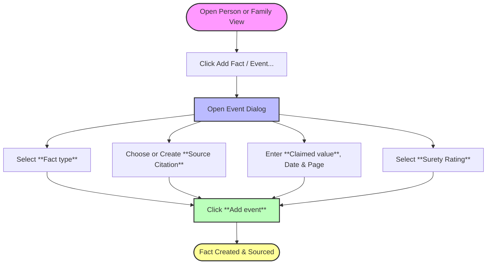

# Adding and Citing Facts

In Theogony's evidence-first architecture, facts and events are never created in a vacuum or attached as an afterthought. Every genealogical assertion must be tied directly to a source document, complete with a surety rating, page reference, and structured values. This page details how to add facts, record surety ratings, and attach sources using the **Event Dialog** (`repo://ui/src/components/EventDialog.tsx`).

---

## Fact Citation Workflow

When recording a new fact or event for an individual or family, Theogony combines fact creation and source citation into a single atomic operation via the `cite_fact` command.

---

## Step-by-Step Procedure

### 1. Opening the Event Dialog
1. Navigate to an individual's **Person View** or a **Family View** (`repo://ui/src/components/EventDialog.tsx#L35-L37`).
2. Click **Add Fact / Event...** in the events or overview panel. This opens the **Event Dialog** (`repo://ui/src/components/EventDialog.tsx#L216`).

### 2. Selecting a Fact Type
1. Click the **Fact type** dropdown (`repo://ui/src/components/EventDialog.tsx#L218`).
2. Choose from built-in standard types (such as Birth, Death, Residence, Marriage) or custom database-registered types (`repo://ui/src/components/EventDialog.tsx#L234-L245`). The list automatically filters to match whether you are editing an individual or a family.

### 3. Attaching or Creating a Source Document
1. Use the **Source** combobox to choose an existing source document from your repository (`repo://ui/src/components/EventDialog.tsx#L250`).
2. If the source is not yet listed, select **New source...** (`repo://ui/src/components/EventDialog.tsx#L265`).
3. Enter the source title in **New source title** and click **Create** to instantly register and select the new source document (`repo://ui/src/components/EventDialog.tsx#L271-L284`).

### 4. Entering Claimed Values & Dates
1. Enter the primary data in **Claimed value** (`repo://ui/src/components/EventDialog.tsx#L289`). The input field adapts dynamically based on the fact type schema (e.g., text inputs for names/places, numeric selectors for counts, switches for booleans, or dropdowns for enumerations) (`repo://ui/src/components/EventDialog.tsx#L288-L382`).
2. Optionally supply a historical date string in **Date** (e.g., `12 May 1920`) (`repo://ui/src/components/EventDialog.tsx#L384-L392`).

### 5. Assigning a Surety Rating
1. Select the evidentiary reliability of the claim from the **Surety** dropdown (`repo://ui/src/components/EventDialog.tsx#L394-L410`). The available surety levels are:
   - **Direct**: Information that explicitly and unambiguously answers the genealogical question (e.g., a birth certificate stating the exact birth date and parents' names).
   - **Indirect**: Information from which a conclusion must be inferred by combining clues or circumstantial evidence.
   - **Negative**: Information indicating the absence of an event or record (e.g., absence from a census suggesting migration or death).
   - **Conflicting**: Information that contradicts other existing evidence, requiring further research and correlation before resolution.

> [!IMPORTANT]
> **Surety Best Practices**
> Always assign **Direct** only when the source explicitly asserts the fact without requiring intermediate deduction. When evaluating census records or tax lists where ages or relationships are approximate, use **Indirect** or **Conflicting** if multiple sources disagree.

### 6. Adding Citation Details & Submitting
1. Optionally record specific repository reference metadata in **Page**, **Entry**, and **Access date** (`repo://ui/src/components/EventDialog.tsx#L412-L425`).
2. Click **Add event** to submit the citation (`repo://ui/src/components/EventDialog.tsx#L432`). The application invokes the `cite_fact` API command, creating both the underlying fact and its source citation atomically (`repo://ui/src/components/EventDialog.tsx#L185-L203`).

---

## Related Guides

- Learn about Theogony's underlying methodology in [Evidence-First Philosophy & GPS Standards](/openwiki/concepts/evidence-first-philosophy.md).
- Manage family connections and relationships in Family Structures.
- Learn how to navigate screens and panels in [Navigating the Interface](/openwiki/workflows/navigating-the-interface.md).
