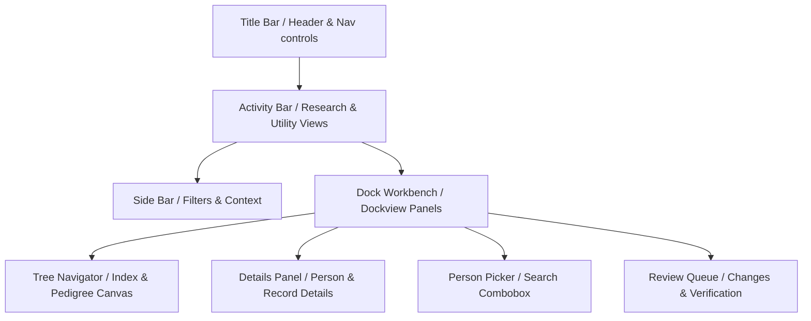

# Navigating the Interface

Theogony provides a VS Code-inspired desktop workspace built with React, Fluent UI React components, and `dockview-react`. The application interface is structured around dedicated activity views, a resizable sidebar, dockable workbench panels, interactive pickers, and a dedicated **Review Queue**.

## Interface Layout and Architecture

The user interface layout consists of a top **Title Bar**, a left **Activity Bar**, a **Side Bar**, and a central dockable workbench (`dockview-react`). Individual records, pedigree trees, family views, and management tools can be opened as side-by-side or tabbed panels within the workbench.

## Key UI Controls & Components

### Tree Navigator
The **Tree Navigator** encompasses index tables (such as the **Individuals Index**) and visual graph canvases (such as the **Pedigree Canvas** and **Family View**). It allows researchers to browse, sort, search, and navigate through individuals across the genealogical tree.
- **Individuals Index**: Displays paginated rows of people with customizable columns, sorting, debounced prefix search, and multi-row selection for operations like merging records.
- **Pedigree & Family Canvases**: Interactive visual layouts enabling direct node selection, parent/child navigation, and expanding ancestral lines.

### Details Panel
The **Details Panel** (represented by the **Individual Record** panel and screen components) serves as the comprehensive property inspector and editor for selected entities.
- **Record Inspection & Editing**: Displays and updates individual attributes such as given name, surname, prefix, suffix, sex, and privacy flags.
- **Embedded Sub-panels**: Houses modular event timelines and relationship matrices to manage life events, citations, parents, spouses, and children.

### Person Picker
The **Person Picker** is a reusable search combobox component used throughout dialogs (such as **Attach Persona Dialog** and **Merge Dialog**) and workflow screens.
- **Debounced Search**: Automatically queries individuals matching the entered text prefix.
- **Exclusion Support**: Supports excluding specific entity IDs (e.g., the primary record being edited or merged) to prevent circular references or self-selection.

### Review Queue
The **Review Queue** provides a centralized interface for inspecting, verifying, and accepting or rejecting pending data changes, merge suggestions, and source extractions.
- **Change Inspection**: Displays side-by-side or diff comparisons of proposed modifications.
- **Batch Operations**: Allows researchers to approve or dismiss items individually or in batches to maintain data integrity.

## Operations & Workflow Integration

1. **Switching Views**: Use the **Activity Bar** on the left to switch between core research views (People, Pedigree, Family, Places, Sources, Review Queue) and utility views.
2. **Opening Records**: Clicking a person in an index or tree opens an **Individual Record** panel side-by-side in the **Dock Workbench**.
3. **Editing & Linking**: Use the **Details Panel** to modify biographical details and manage family relationships, utilize the **Person Picker** when attaching personas or merging duplicate records, and check the **Review Queue** to validate pending changes.
