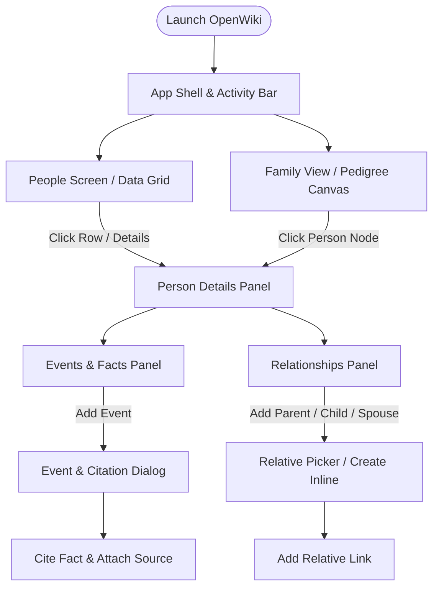

The OpenWiki genealogical workbench provides an evidence-first interface for exploring individuals, asserting and citing historical facts, managing surety ratings, and structuring family relationships. This page documents the core user workflows for navigating the application interface and performing genealogical data entry.

## Interface Navigation

The OpenWiki interface is organized around a primary layout shell featuring an **Activity Bar**, a **Side Bar**, the **Tree Navigator** (Family View / Pedigree Canvas), the **Details Panel**, and the **Person Picker**.

### 1. Tree Navigator & Family View
- **Family View (`FamilyView.tsx`)**: Renders the central pedigree and family neighborhood for the currently focused individual (`focusedPersonId`). It displays grandparents, parents, the focus individual, spouses, siblings, children, and grandchildren.
- **Context Menus & Actions**: Clicking on any person card in the tree or data grid allows users to set them as the focus person (**Set focus**), set them as the home person (**Set home**), or open their full editor (`PersonEditorDialog`).

### 2. Details Panel & Person Screen
- The **Details Panel** and **Person Screen** provide comprehensive access to an individual's biographical facts, attributes, and familial connections.
- Navigation between individuals updates the active entity context (`ActiveEntityContext`), instantly refreshing panels without full page reloads.

### 3. Person Picker (`PersonPicker.tsx`)
- Used throughout merge workflows, attach personas, and relationship linking.
- Features a debounced search combobox (`listPeople`) that queries individuals by name prefix while excluding current or invalid targets.

---

## Adding and Citing Facts

Every factual assertion in OpenWiki is anchored by source documentation. Facts cannot exist independently of citations.

1. **Opening the Event Dialog**:
   - Navigate to a person's **Events Panel** and click **Add event** (`CalendarAddRegular`), or access family events through spousal relationship actions.
   - This opens the `EventDialog`, supporting both individual and family event subjects.

2. **Selecting Fact Types and Sources**:
   - Choose a standardized **Fact Type** (e.g., Birth, Death, Marriage, Residence) managed via the `FactTypesManagerDialog`.
   - Select an existing **Source Document** from the dropdown, or create a new source inline by entering a title and triggering **Create Source** (`createSourceDocument`).

3. **Asserting Details and Citing**:
   - Provide the **Claimed Value** (the raw transcribed text or assertion), **Date Text**, **Place** (via `SmartPlaceInput`), **Page**, **Entry**, and **Access Date**.
   - Submitting executes the atomic `citeFact` command, creating the underlying fact and linking it to the specified source document in a single transaction.

---

## Recording Surety Ratings

To reflect genealogical certainty and source reliability, every fact citation requires a **Surety Rating** (`SURETY_VALUES` in `EventDialog.tsx` and evidence definitions):

- **Direct**: Primary or first-hand evidence that directly answers the genealogical question with high reliability.
- **Indirect**: Secondary or circumstantial evidence that requires logical inference or correlation to establish a fact.
- **Negative**: Evidence demonstrating the absence of an event or record where it would normally be expected to appear.
- **Conflicting**: Evidence that directly contradicts other sources or assertions, signaling a need for review or dispute resolution.

---

## Working with Family Structures

Family structuring is managed through the **Relationships Panel** (`RelationshipsPanel.tsx`) and **Family View** (`FamilyView.tsx`), supporting parent-child lineages, spousal bonds, and custom role labeling.

### 1. Parents, Children, and Spouses
- The **Relationships Panel** groups connections into three distinct sections: **Parents**, **Children**, and **Spouses**.
- Each section provides an always-visible **Add ___** button (e.g., **Add parent**, **Add child**, **Add spouse**) that opens the inline `RelativePicker`.

### 2. Relative Picker & Inline Creation
- **Linking Existing Individuals**: Search for an existing person using the combobox lookup.
- **Creating Inline**: If the relative does not yet exist in the database, users can provision a new individual directly within the picker workflow (`createIndividual`).
- **Role Labels**: Optional role labels can be attached, validated against the system vocabulary (`listRoleLabels` with `context: "fact_participant"`).

### 3. Custom Facts & Jurisdictions
- **Fact Types Manager**: Users can define custom fact types, specify applicability (individual vs. family), and configure custom field schemas (`FactTypesManagerDialog`).
- **Jurisdictions & Places**: Places and historical jurisdictions are managed via dedicated place editors and smart inputs (`SmartPlaceInput`), ensuring geographic accuracy across life events.
